# Exploring watsonx.ai User Interface

## Getting Started

Ensure you have created an account in the previous exercise, see [Setup IBM Cloud account](0_prerequisites/README_setup_ibm_cloud_account.md)
Now, login to your IBM Cloud account with the email you have provided us.

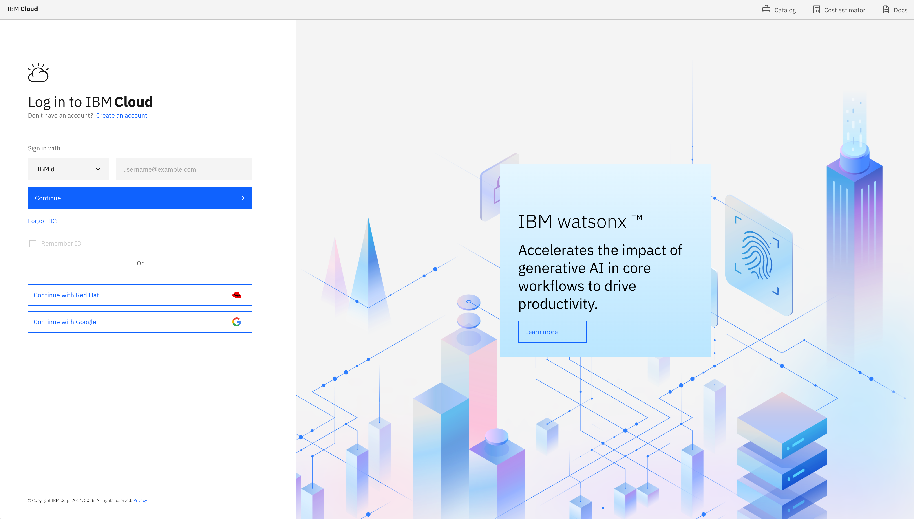

## Select the right cloud account

Make sure you select the account which starts with the number `3022616`

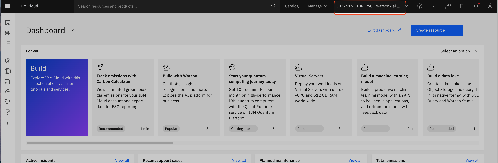

## Access watsonx.ai

From the hamburger menu on the right, select "Resource List"
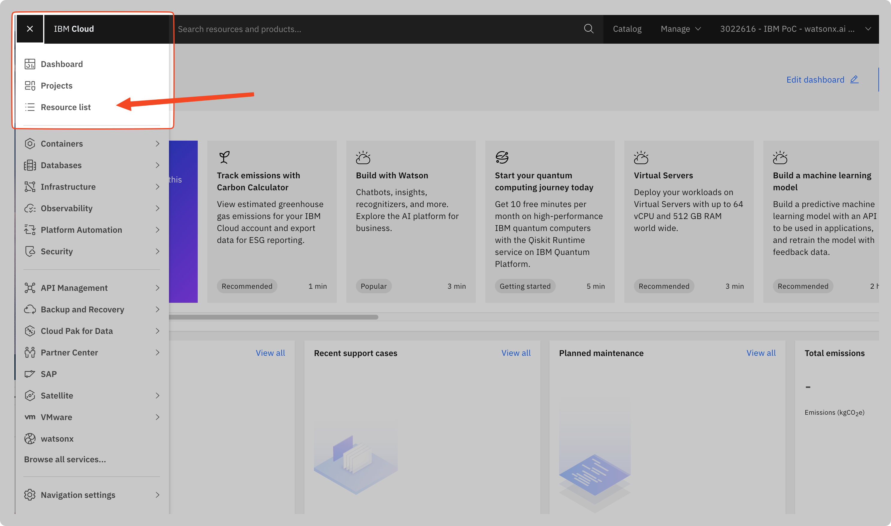

Select the watsonx.ai service "watsonx.ai Runtime-zp" in the group "dtag"
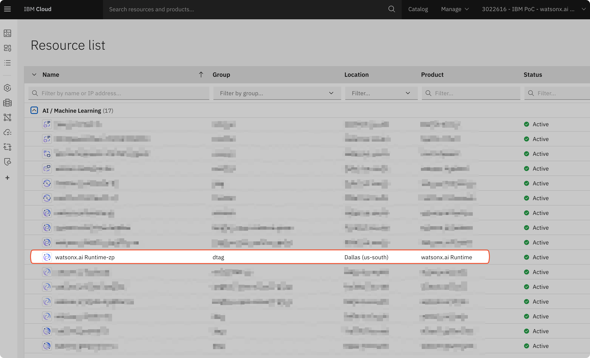

Click on the name "watsonx.ai Runtime-zp", on the new page select the arrow down and click "launch in IBM watsonx" (not IBM Cloud Pak for Data)
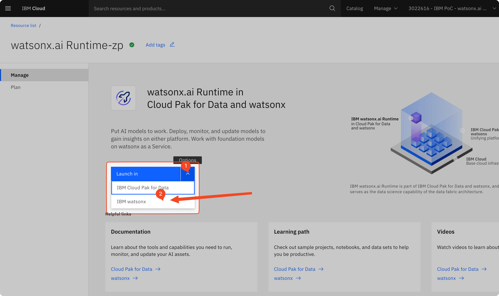

# Create a project

1. From the watsonx homepage, click Main menu -> Projects -> View all projects. 
   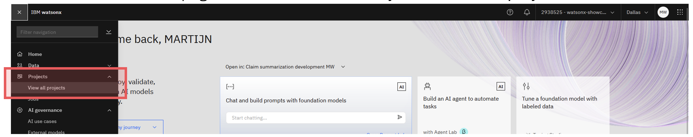
2. From the list of projects, click on the New project button. 
   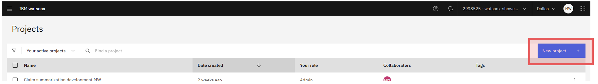
3. Fill in the fields
   1. Name = “Claims summarization for Evaluation Studio”, and add your initials
   2. Description = “Development project for claims summarization solution”
   3. Select the appropriate storage service
   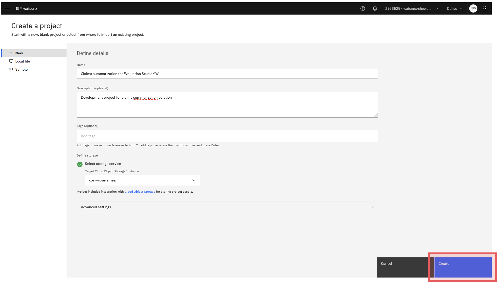
4. Click on Create. 
5. When you’re project is ready, go to the Manage tab, then the Services and integration option in the left-hand menu. 
   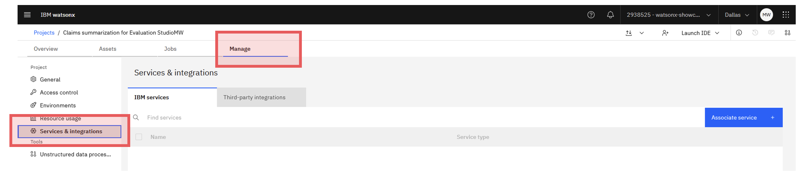
6. Click the Associate service button. 
   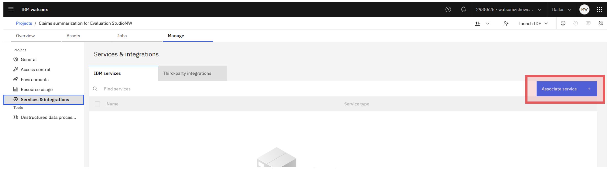
7. Select the appropriate watsonx.ai Runtime service in your environment, and click Associate. (Note: The service name in your case might be different. You just need to make sure that it's a `watsonx.ai Runtime`)
   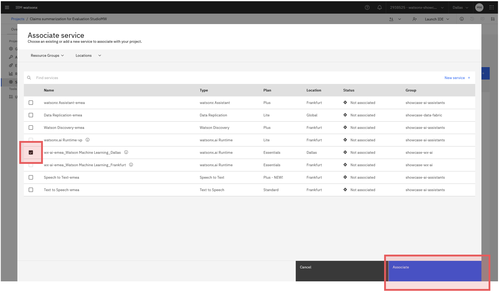

# Prompt Lab

Let's begin creating our first prompt using watsonx.ai. 
1. Head over to the Assets tab of the project home page. Once there, click on New Asset.
   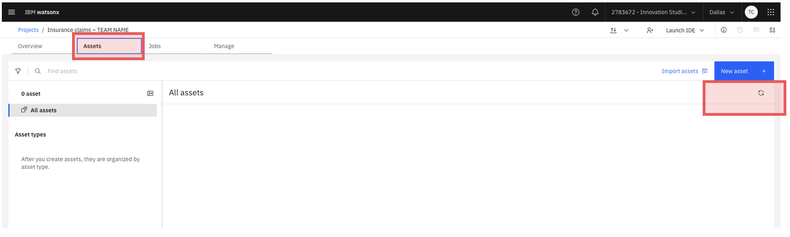
2. Now, if you scroll down on the menu that appears, you should see a card that says Chat and build prompts with foundation models. Click on that card.
   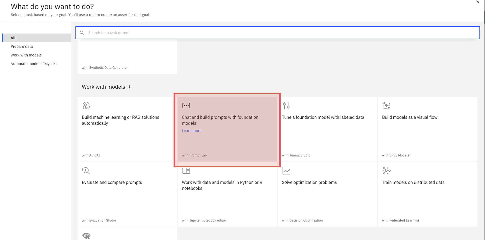

Now, You will be taken into the watsonx.ai Prompt Lab. If there is an option to take a tour, skip it. This screen has numerous options on how you can configure your prompt to suit your needs.

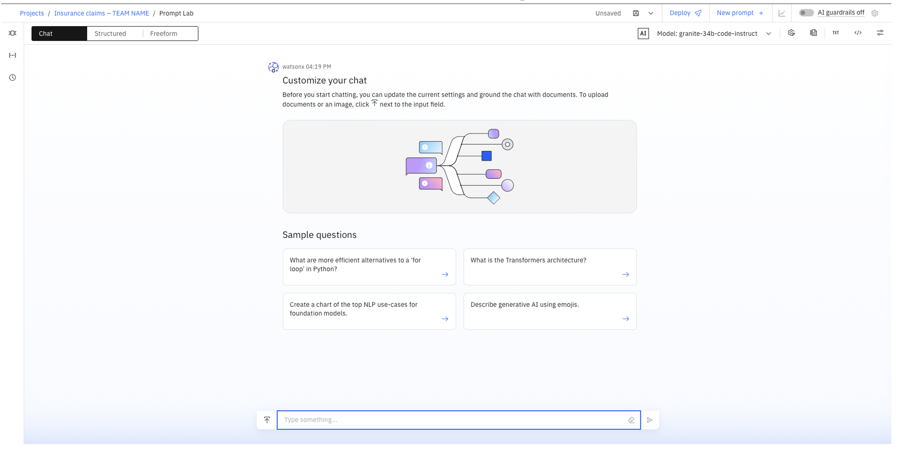

On the top left corner, you will see the option to select “Chat”, "Structured" or "Freeform". 
* **Structured prompts** have easily identifiable sections to place examples, instructions, and prompt variables (which we will discuss later). 
* **Freeform prompts** have a looser and more flexible structure. 
* **With Chat mode**, you can chat with the foundation model to see how the model handles dialog or question-answering tasks.

This lab will walk through utilising the **Structured prompt** functionality, however this is possible to do with freeform as well, so choose whichever option is the most comfortable for you!  

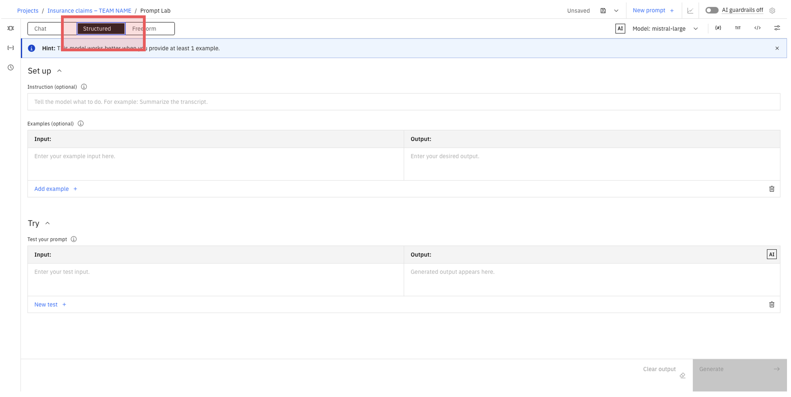

1. Select the **“mistral-medium-2505”** model from the menu on the top right. 
   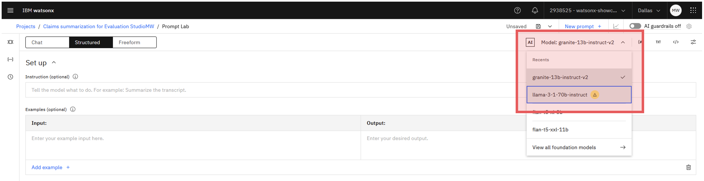
2. Inside of the Instruction box, you can write your instruction given to the model. Copy & paste the prompt from below: 
   #### Prompt
   > “You are an insurance agent tasked to assess insurance claims. Summarise the following insurance claim input.  Focus on the car and the damage. Make the summary at least 3 sentences long.
   >
   > Claim:
   >
   > {input}
   >
   >Summary:”

   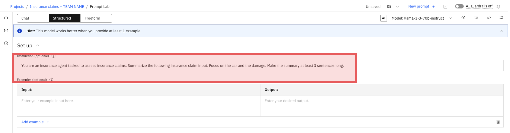

### Prompt Variables

Now, we need to ensure that we can test our prompt against validation and test data. To do so, we need to ensure we have prompt variables set up for our instructions. 
1. Click on the Prompt variables button. 
   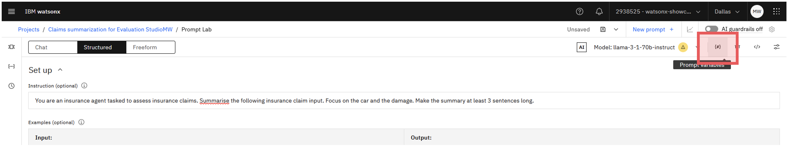
2. Click on the New variable button. 
   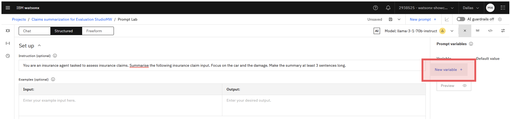
3. Once you have opened this sidebar, you will see two empty boxes pop up, with Variable and Default Value able to be filled out. Use **"input"** as the variable name and leave the default value **empty**. 
   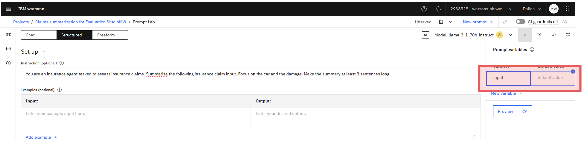
4. By scrolling down your page, you will notice an area on the screen titled Try. Inside of this, you want to put a variable titled **{input}** (with the curly brackets). This variable will be replaced by input insurance claims at inference time. 
   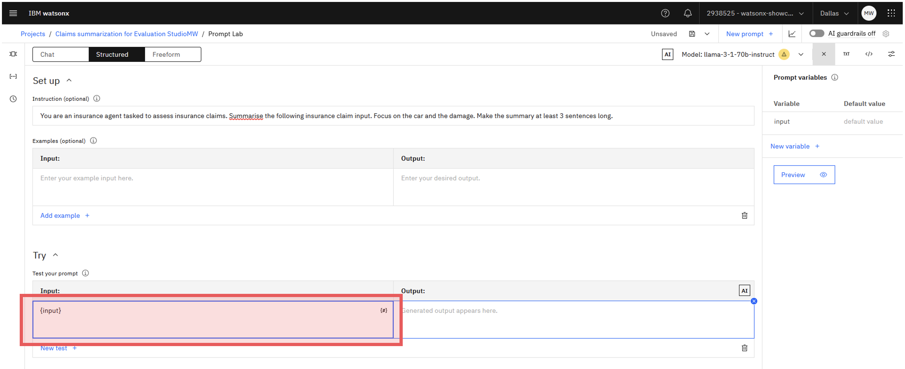

### Model Parameters

Next to where you clicked prompt variables, you should see an option that says Model parameters. Click on that button. 

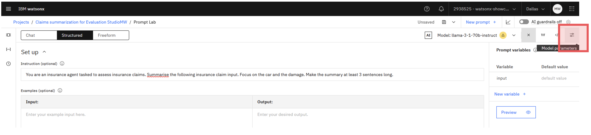

We will not be making any serious changes here just yet but mostly giving a tour of this section so you can make modifications later.

Most importantly, you will see a toggle for Greedy or Sampling. 
* Selecting **greedy** will allow your model results to be reproduceable across experiments, while selection sampling will give you more variability.
* Switch the toggle to **sampling**. 

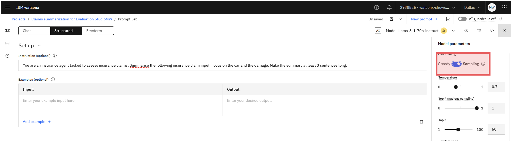

Now that you have chosen sampling, you will see several new options pop up that are specific to the sampling decoding method. Temperature is the most important factor here, where setting a higher temperature will give higher variation and more unique outputs. Hover over the info icons to gain more information on Top P and Top K methods as well.

Lastly, scroll all the way down the Model parameters section to find the Stopping criteria as well as Token limits. For LLMs, tokens ~ words, so we want to set that higher to get more detail in our summaries of the insurance claims. Change the Max tokens field to 300. 

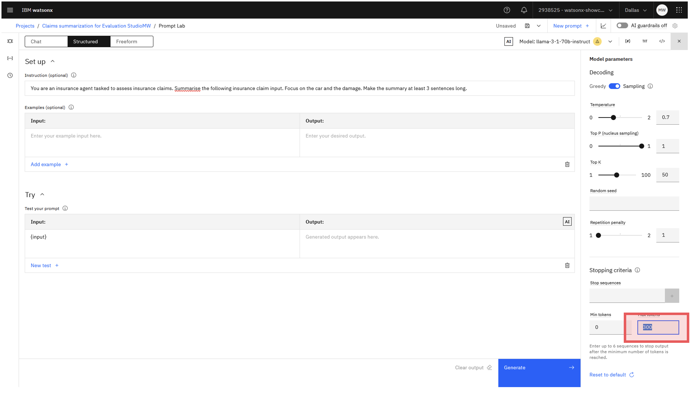

#### Sample claim (optional)

If you want, you can use the following the sample claim to test your prompt. Click on prompt variables (`{#}`) on the upper right hand corner and copy the text into the field under `Default value`.

> On November 1st, 2023, at 11:00 AM, my vehicle, a 1998 Nissan Maxima, was involved in a severe accident in New York. My driver was raveling within the speed limit when another vehicle suddenly stopped in front of them, causing a frontal collision. The impact was significant, resulting in extensive damage to both vehicles. My driver immediately contacted emergency services and received medical attention at the scene. My vehicle sustained damage to the front bumper, hood, and windshield. My driver suffered severe injuries and is receiving ongoing medical treatment. I immediately called your agent and submitted the claim form providing the accident details, police report, and medical documentation. I am also providing witness statements and photographs of the damaged vehicle.

### Saving the Prompt

Once you are all finished, click the Save icon dropdown in the top right, and then click Save as. 

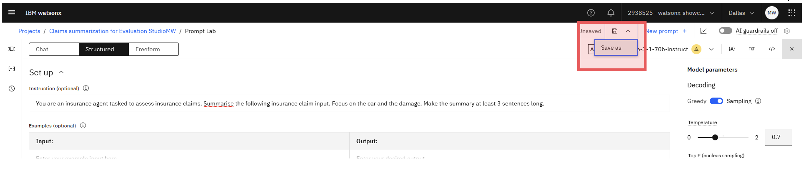

In the Save your work screen:
* Asset type = Prompt template
* Name = “Insurance Claims Summarization prompt template”
* Task = Summarization
* Description = “Gen AI prompt to help summarize new insurance claims”
* View in project after saving = not checked
Click the Save button.

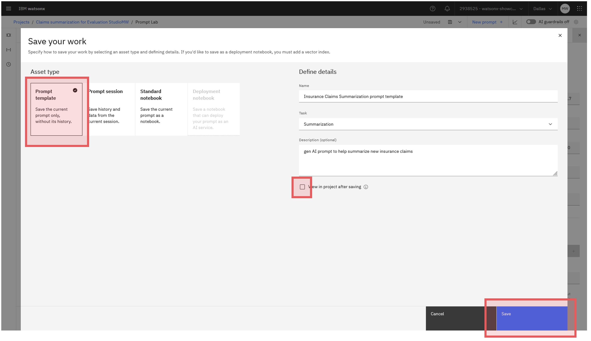

You have now successfully designed your first prompt template! 🥳

For more information about the prompt lab, please visit: https://www.ibm.com/docs/en/watsonx/saas?topic=prompts-prompt-lab

# Deployment

Click on the hamburger menu on the upper left-hand side and click on `View all deployment spaces`. Click on `New deployment space` to create a new deployment space.

Fill in the details (e.g. use your own credentails for the name of your deployment space) and click on `Create` and wait for the deployment space to be created.

Go back to your project, click on the three dots next to the prompt template `Insurance Claims Summarization prompt template - Mistral` and click on `Promote to space`. 

Select the deployment space that you just created and click on `Go to the prompt template in the space after promoting it`. Then click on `Promote`. 

In the next screen that appears, click on `New deployment`.

Enter a name (e.g., `claims_deployment`) for the deployment and click on `Create`. 

Now, you can click on the deployment and check out all the API details.

You successfully deployed a prompt template which you now can inference using the API and integrate this into your application.