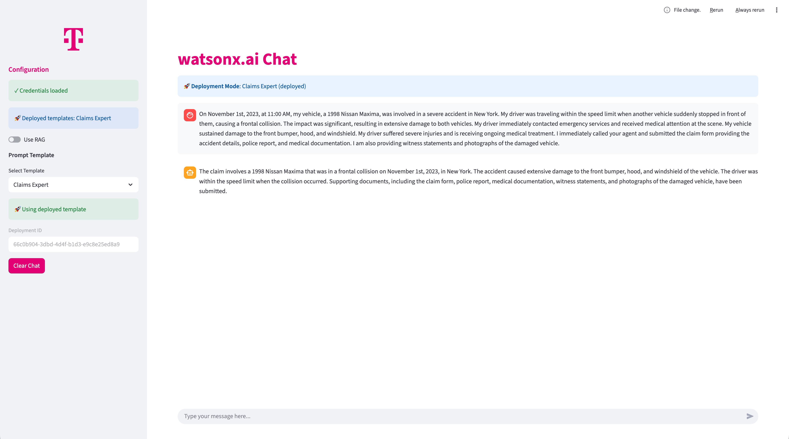
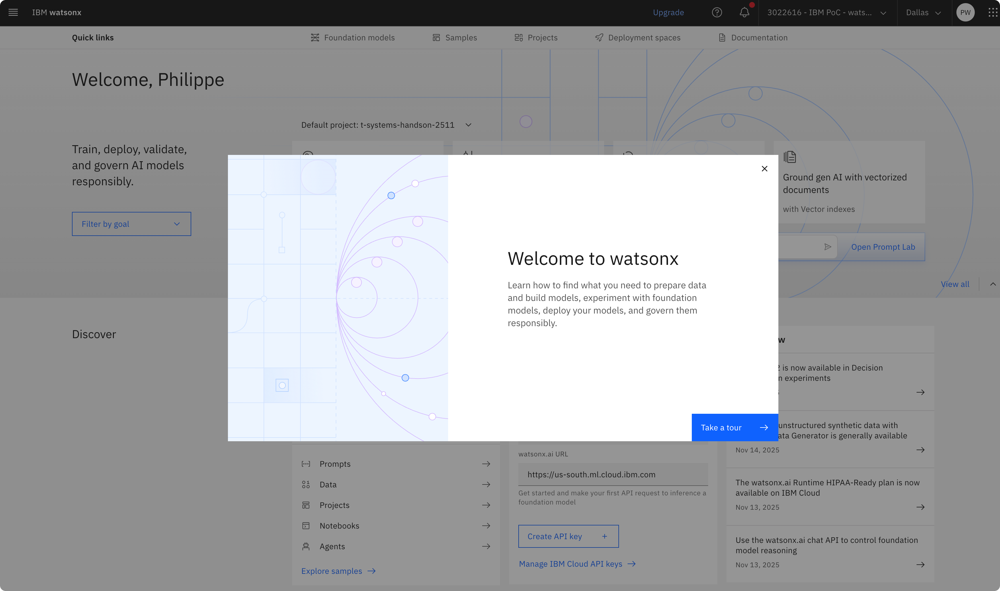
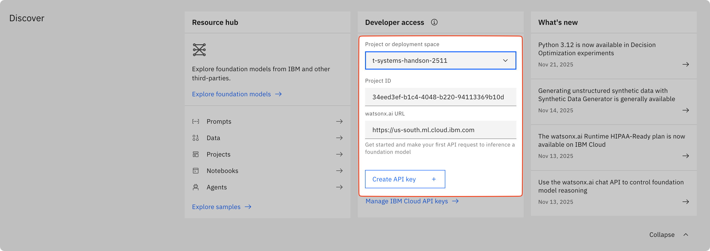

# Chat with your models

A Streamlit-based chat interface for watsonx.ai with support for multiple models and prompt templates.



## Features

- **Two inference modes**: Direct model inference or deployed prompt templates
- Multiple prompt templates (Customer Service, Claims Expert, Log Analysis Assistant, Custom)
- Support for various watsonx.ai models (Granite, Llama, Mistral, etc.)

## watsonx.ai Background

IBM watsonx.ai is an enterprise-ready AI and data platform designed to multiply the impact of AI across your business. It provides a comprehensive suite of AI tools including:

- **Foundation Models**: Access to IBM's Granite models and popular open-source models like Llama, Mistral, and more
- **Prompt Lab**: Interactive environment for experimenting with prompts and fine-tuning model responses
- **Model Training**: Tools for training, tuning, and customizing models with your own data
- **Deployment & Governance**: Enterprise-grade model deployment with built-in governance, risk management, and compliance features

## Prerequisites

To use this application, you will need the following:
- IBM Cloud account
- uv installed

## API Access

You can generate an API key by following these steps:
1. Log in to your IBM Cloud account.
2. Navigate to the watsonx.ai dashboard.


3. Under the section "Discover" you will find the "Developer Access". There you will find your "WATSONX_PROJECT_ID" and "WATSONX_AI_URL".
4. To generate your "WATSONX_API_KEY", click on the "Create API key" button.


5. Enter a name for your API key and click on the "Create" button to generate the API key and save it. You'll need these credentials later during configuration.

## Installation

Enter the project folder and install the dependencies with uv:

```bash
cd 2_chat-with-your-models
uv sync
```

## Configuration

### 1. Copy the example environment file

```bash
cp .env.example .env
```

### 2. Configure watsonx.ai credentials

Edit `.env` and add your watsonx.ai credentials which we have just gathered in the previous step.

```bash
# watsonx.ai Configuration
WATSONX_API_KEY=your_api_key_here
WATSONX_PROJECT_ID=your_project_id_here
WATSONX_URL=https://us-south.ml.cloud.ibm.com

# Prompt Template Deployments
# You can either use a provided template_id or use your own from the deployment you have done in 1_wx-UI of this lab
CLAIMS_EXPERT_DEPLOYMENT_ID=your_deployment_id
```

## Running the Application

```bash
uv run streamlit run app/frontend/app.py
```

The application will open in your default browser at `http://localhost:8501`

## Usage

### Customer Service

Helpful assistant for Deutsche Telekom customer inquiries about products, services, billing, and general support

1. Select the prompt template "Customer Service" from the sidebar.
2. Choose a model from the dropdown
3. Start chatting!
4. Use "Clear Chat" to reset the conversation

### Claims Expert

Deployed template for an insurance claims specialist for Versi services, helping to summarize given claims

1. Select the prompt template "Claims Expert" from the sidebar. The deployed template will be used here.
2. Start chatting with an example claim:

```
On November 1st, 2023, at 11:00 AM, my vehicle, a 1998 Nissan Maxima, was involved in a severe accident in New York. My driver was traveling within the speed limit when another vehicle suddenly stopped in front of them, causing a frontal collision. The impact was significant, resulting in extensive damage to both vehicles. My driver immediately contacted emergency services and received medical attention at the scene. My vehicle sustained damage to the front bumper, hood, and windshield. My driver suffered severe injuries and is receiving ongoing medical treatment. I immediately called your agent and submitted the claim form providing the accident details, police report, and medical documentation. I am also providing witness statements and photographs of the damaged vehicle.
```
3. Use "Clear Chat" to reset the conversation

Note: no model choice here as this was selected in the prompt template in watsonx.ai.

### Custom:

Define your own system prompt

1. Select the prompt template "Custom" from the sidebar. Give the assistant a role and purpose.
2. Choose a model from the dropdown
3. Start chatting!
4. Use "Clear Chat" to reset the conversation

### Log Analysis Assistant

1. Select the prompt template "Log Analysis Assistant" from the sidebar.
2. Choose a model from the dropdown
3. Before you start chatting, see lab [8_evaluate-your-log-data/README.md](8_evaluate-your-log-data/README.md) for more details.
4. Use "Clear Chat" to reset the conversation

### Available Models

- Granite 3.3 8B
- Granite 8B Code
- Llama 3.2 90B Vision
- Llama 3.3 70B
- Llama 3 405B
- Llama 4 Maverick 17B
- Mistral Medium
- Mistral Small 24B (default)
- GPT OSS 120B

## Advanced Features

### RAG Mode (Retrieval Augmented Generation)

This application also supports RAG mode for chatting with document knowledge bases.

**We will explore RAG features later in the lab in [External Data (RAG) guide](../5_external-data/README.md).**


## Troubleshooting

### Missing Dependencies

If you see import errors:

```bash
uv sync
```

### Credentials Not Found

Make sure your `.env` file contains:
- `WATSONX_API_KEY`
- `WATSONX_PROJECT_ID`
- `WATSONX_URL`

## License

Sample Materials, provided under license.
Licensed Materials - Property of IBM.
© Copyright IBM Corp. 2024,2025. All Rights Reserved.
US Government Users Restricted Rights - Use, duplication or disclosure restricted by GSA ADP Schedule Contract with IBM Corp.
