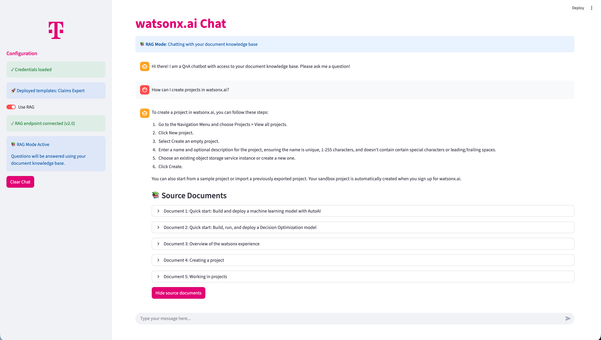

# External Data - RAG (Retrieval Augmented Generation)

This guide shows how to enable RAG mode in the chat application to query your document knowledge bases using watsonx.ai QnA RAG deployments.



## Prerequisites

Complete the basic chat setup first:
1. Follow [2_chat-with-your-models/README.md](../2_chat-with-your-models/README.md)
2. Ensure the basic chat application works
3. Have a QnA RAG deployment ready in watsonx.ai

## What is RAG Mode?

RAG (Retrieval Augmented Generation) mode allows you to:
- Chat with your document knowledge base
- Get answers backed by source documents
- View and verify information sources
- Provide feedback on answer quality
- Get expert recommendations for complex questions

## Configuration

### 1. Update your `.env` file

Navigate to `2_chat-with-your-models/.env` and add the RAG configuration:

```bash
# Enable RAG Mode
USE_RAG=False

# RAG Deployment Configuration
QNA_RAG_DEPLOYMENT_URL=https://us-south.ml.cloud.ibm.com/ml/v4/deployments/your-deployment-id/predictions
QNA_RAG_ENV_TYPE=saas
QNA_RAG_SAAS_IAM_APIKEY=your_iam_apikey_here
```

## Running with RAG

```bash
cd 2_chat-with-your-models
uv run streamlit run app/frontend/app.py
```

## Using RAG Mode

### 1. Enable RAG

1. Open the application
2. In the sidebar, toggle **"Use RAG"** to ON
3. Wait for the connection check (green checkmark = success)

### 2. Ask Questions

Try these sample questions:

#### Sample Q&A Questions
- How can I create projects in watsonx.ai?
- Tell me more about CPLEX
- How can I connect to Azure BLOB Storage?

### 3. View Source Documents

- After receiving an answer, click **"Show source documents"**

## Features in Detail

### Source Document Display

- **Toggle visibility**: Show/hide documents without losing them
- **Document metadata**: Title, URL, and relevant excerpts
- **Expandable sections**: Click to see full document details

## Troubleshooting

### Connection Failed

**Symptoms:** Red X with "RAG connection failed"

**Solutions:**
1. Verify `QNA_RAG_DEPLOYMENT_URL` is correct
2. Check IAM API key or CPD credentials are valid
3. Ensure the deployment is active in watsonx.ai
4. Test network connectivity to the endpoint
5. Check deployment logs in watsonx.ai

### No Source Documents

**Symptoms:** Answer provided but no documents shown

**Possible causes:**
1. Question not found in knowledge base
2. RAG deployment configuration issue
3. Document retrieval threshold too high

**Solutions:**
- Try rephrasing your question
- Check RAG deployment settings
- Verify documents are properly indexed

## Support

For issues or questions:
1. Check this README for troubleshooting
2. Review error messages in the UI
3. Check browser console for detailed errors
4. Verify all configuration in `.env`
5. Test RAG deployment directly in watsonx.ai

## Related Documentation

- [Chat Application Setup](../2_chat-with-your-models/README.md)
- [RAG Integration Guide](../2_chat-with-your-models/RAG_INTEGRATION_GUIDE.md) (Technical details)
- [watsonx.ai Documentation](https://www.ibm.com/docs/en/watsonx-as-a-service)

## License

Sample Materials, provided under license.
Licensed Materials - Property of IBM.
© Copyright IBM Corp. 2024,2025. All Rights Reserved.
US Government Users Restricted Rights - Use, duplication or disclosure restricted by GSA ADP Schedule Contract with IBM Corp.