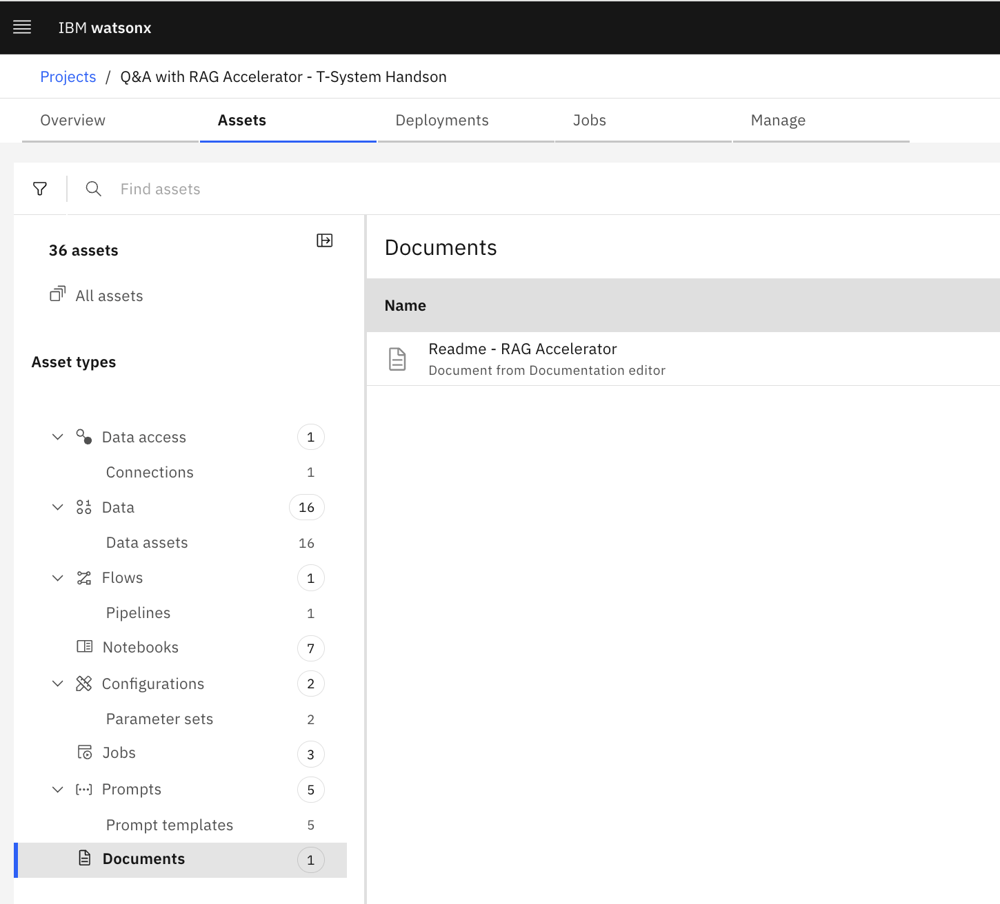
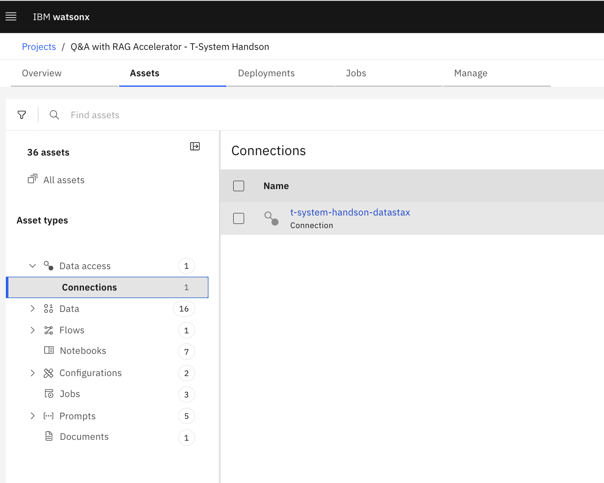
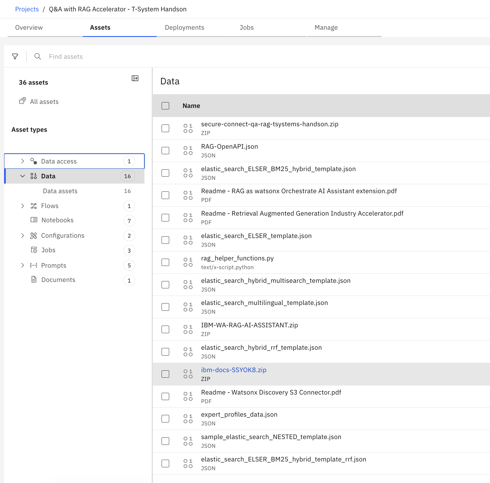
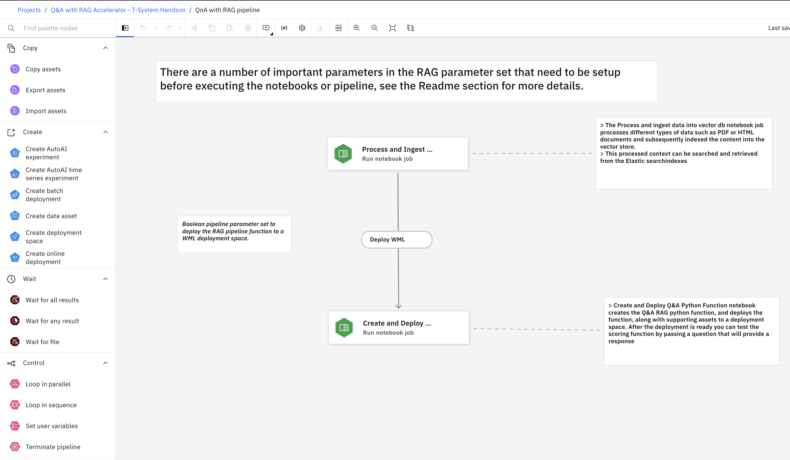
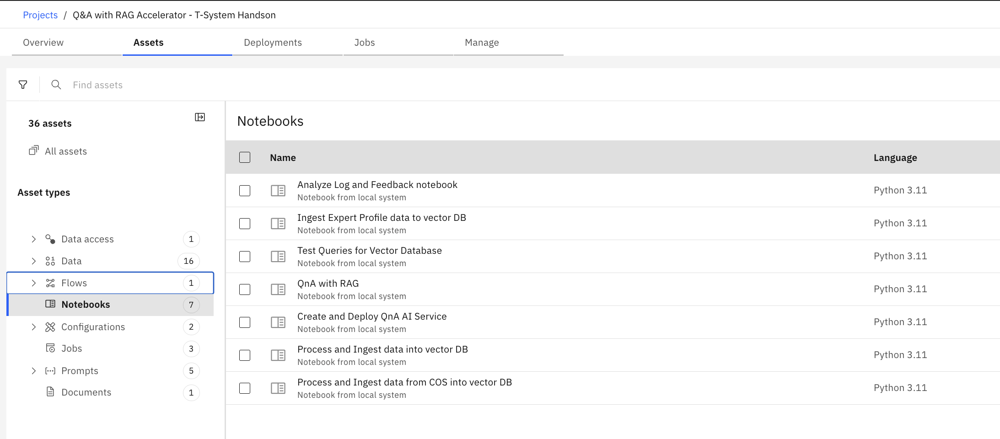
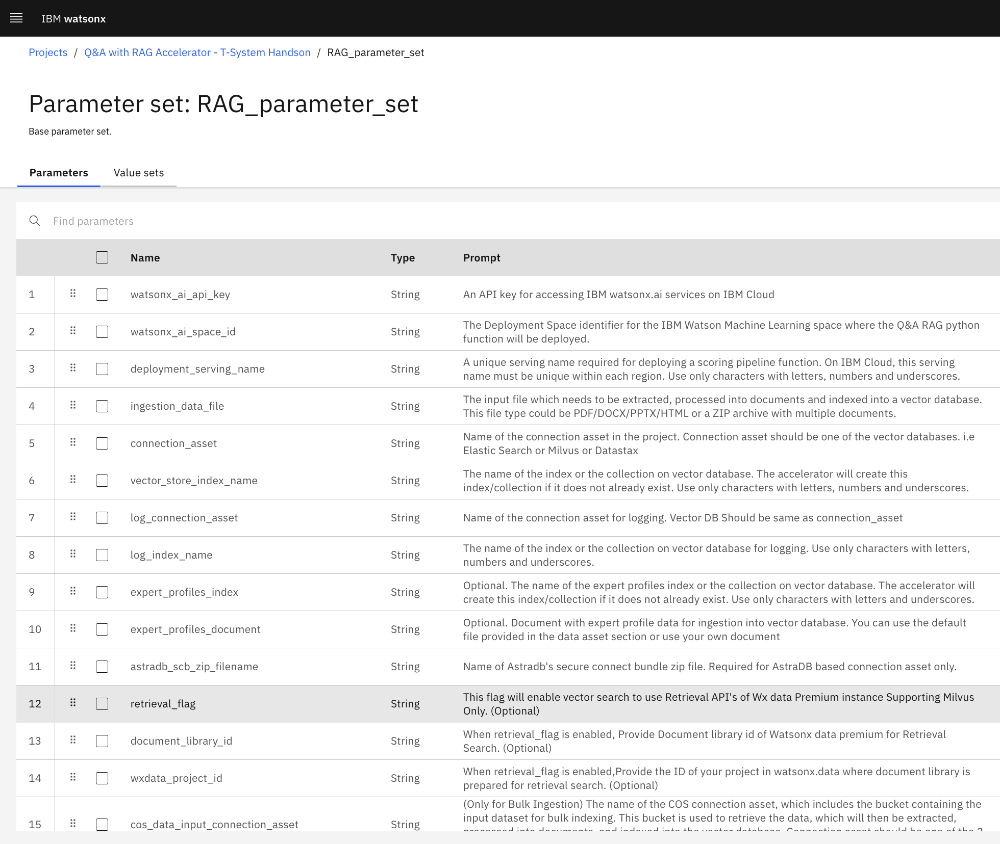
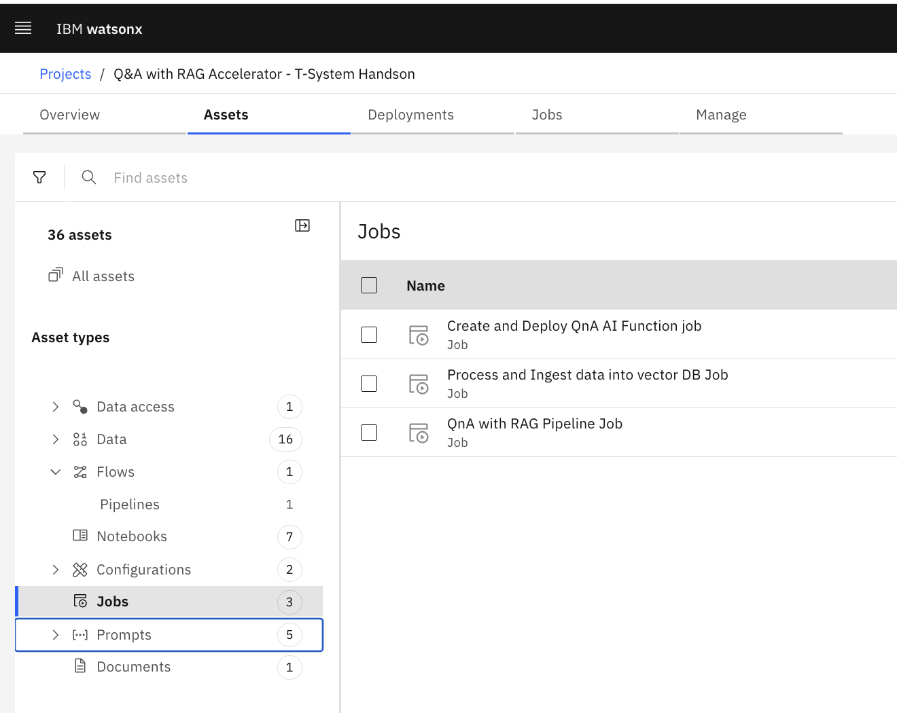
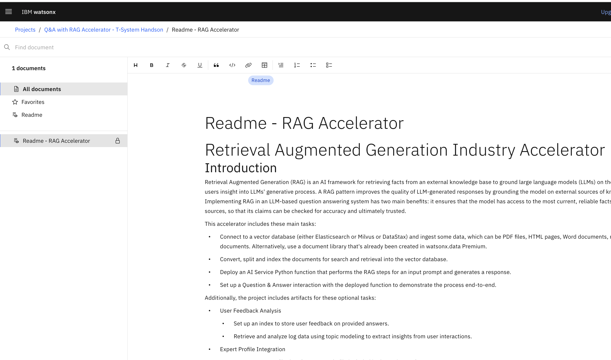

# Optional Lab - Enterprise RAG Asset Exploration
In this optional lab you will take a more detailed look into the elements of the QA RAG Asset from IBM. 
Do not change anything inside this project, make sure you only take a look and explore the elements the asset is made of.

## Prerequisites
Make sure you have access to the watsonx.ai project on our PoC Account - called *Q&A with RAG Accelerator - T-Systems Handson*. It has been created before with proper Admin permissions based on a Sample shipped with watsonx.ai (for SaaS and on-prem).

## Explore Project Structure
If you have access to the project, select it and navigate to the **Assets** tab. You should see the following screen.

### Data access
Lets start with the *Data access* section. What you will see there is the connection to the Vector database in use for this Lab. Due to simplicity we have chosen AstraDB for now, supported are also Milvus, ElasticSearch, watsonx Discovery as well as OpenSearch in the next release.

### Data
The Data section includes objects that have been imported into the watsonx.ai project. These are stored in an associated Cloud Object Storage metadata bucket. 

**ibm-docs-SSYOK8.zip** contains the documents that are used for populating the VectorDB as knowledge base. It's a subset of the watsonx.ai documentation with around 1200 HTML articles. 

### Flows
The Flows section has an example of a watsonx Pipeline called **QnA with RAG pipeline**.

Pipelines allow you to automate Maschine Learning tasks in watsonx.ai with a graphical control flow editor. In this example Notebooks are orchestrated via Notebook Jobs to populate the Vector Index and deploy the AI service.

### Notebooks
watsonx.ai provides a data science collaboration environment also for Jupyter Notebooks. SPSS, Decision Optimization and R are also supported Data Science tooling choices.

Overview of the Asset notebooks:

1. **Process and Ingest data into vector DB**: Used to do the data processing, loading, splitting, chunking of the documents. Creating the embeddings and writing them into the different supported vector databases.

2. **Process and Ingest data from COS into vector DB**: Similar to one with the focus on mass data. If you haven't uploaded the data into the watsonx.ai project, but have it available in a COS bucket. 

3. **Ingest Expert Profile data to vector DB**: In case you do not have high confidence answers an appropriate Expert recommendation can be given as a contact. This Notebook populates the Vector Index that contains the Expert Profiles included competencies and contact data.

4. **Create and Deploy QnA AI Service**: This Notebook cares for the deployment of the required prompt templates and AI Services into the corresponding Deployment space.

5. **Test Queries for Vector Database**: This notebook provides examples for exploring document search within a vector database. Experiment with different search techniques using Elasticsearch or Milvus or Datastax as your chosen database.

6. **QnA with RAG**: In this notebook, questions are passed to the deployed function and retrieves the answers from the LLM based on RAG. 

7. **Analyze Log and Feedback notebook**: Use this notebook to gain insights into user's feedback. This notebook implements log data retrieval, data preparation, topic modeling and correlation analysis. It forms a basis for feedback analysis and is intended to be enhanced by more functions.

### Configurations
Configuration, for example Parameter Sets, can be used to centralize parameters / environment variables in a watsonx.ai project. The asset uses one basic parameter set (shown here) and an advanced parameter set for optimizing various aspects of a RAG solution.

### Jobs
Jobs can be used to automate Data Science activities for example via Pipelines or Jupyter Notebook jobs.

### Prompts
Prompt Templates are provided for different LLMs. The default Prompt Templates is based on Llama 3.3 70B. Examples for Llama 4 Maverick and Granite are provided as well.

### Documents

Last but not least a document editor is included. The provided README from the Asset explains the detailed steps how to get started with the Enterprise RAG asset.

