## Governing generative models

In this section of the lab, you will govern a watsonx.ai foundation model. In this case, the automotive claims department wants to use a generative AI model to summarize auto insurance claims, which they believe will significantly reduce the workload for their claim review department and improve claim response time. However, they have seen news reports about potential issues with generative AI models providing inaccurate information, being prone to responding with hateful, aggressive, or profane (HAP) speech, or potentially leaking personally identifiable information (PII). They need to put a system in place to monitor and evaluate their model to address their concerns before they begin using the model in production.

---

### 1. Define an AI use case

As with predictive models, stakeholders in the company will need to create an AI use case to govern their claim summarization model. This AI use case (which is stored in the model inventory identified - or created - in the first step of the lab), will allow administrators, AI engineers, risk managers, and data scientists to organize the different versions, data, and environments used to build and deploy the candidate models.

1. Sign in to IBM watsonx. You may need to follow the instructions starting from step 2 in the Reserving a TechZone shared account section to sign in.
2. Click on the Navigation menu in the upper left (A) to expand it.  Locate the AI governance section of the menu (B), expanding it if necessary, and click on the AI use cases menu item (C).

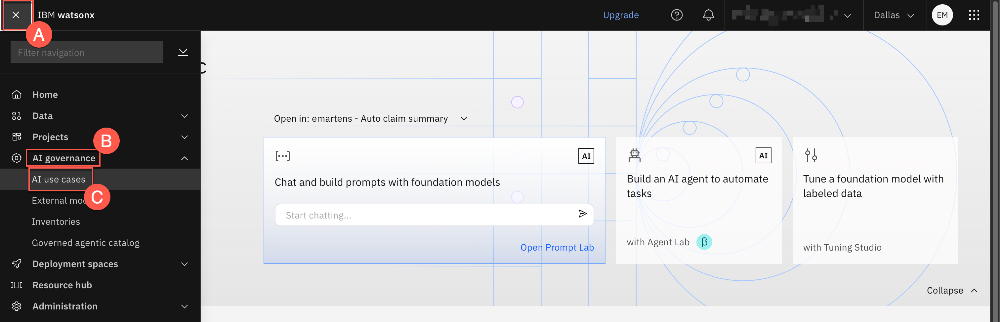

3. Click the **New AI use case** button to open the **New AI use case** window. Note that if you do not have a **New AI use case** button, you will need to create or gain access to a model inventory, as described in the Identify a model inventory section.

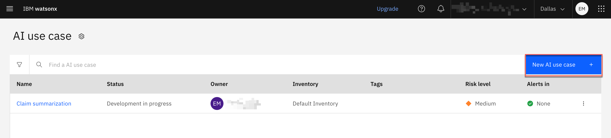

4. Give your use case a name (A). (For example, "Claim summarization".) If you are using a shared account, add some identifying information such as **your** email address to mark it as belonging to you.

Give your use case a description (B) for the business issue it is attempting to solve.

Use the **Risk level** dropdown (C) to set the associated level of risk. In a real-world example, this would be performed by the risk management officer of an organization. Future integration with IBM OpenPages will offer more risk management functionality.

Use the **Inventory** (D) dropdown to select the model inventory you identified in a previous step.

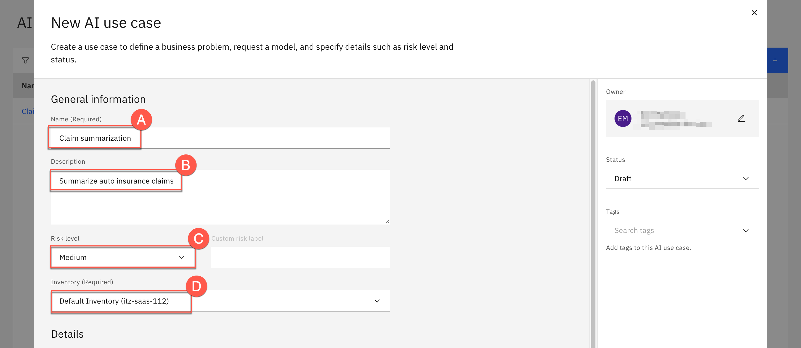

5. Click on the **Status** dropdown on the right side of the screen, and note the different values available.

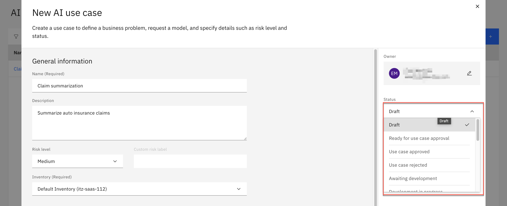

Watsonx.governance allows for organizations to implement formal approval procedures around their model lifecycles. In this case, the auto policy team has requested development of a new model to take into account information gathered by their data scientists. They create a use case for the business problem to request further exploration and development (the *Ready for use case approval* status), and can update the status of the use case as it moves through the process, from initial approval (the *Use case approved* status) to the assigning of AI engineering resources (the *Awaiting development* status). For this lab, you will move directly to an approved use case.

6. Use the dropdown to set the **Status** (A) to **Development in progress**.

Click on the **Create** button (B). After a minute or so, the use case will be created.

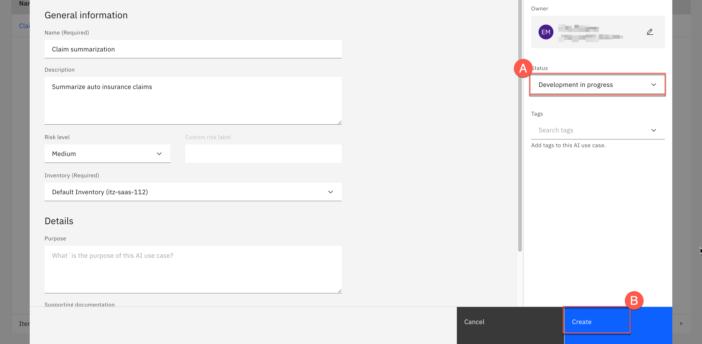

7. Take a moment to review the use case screen, and note the **Access** tab, which allows sharing of the use case with other stakeholders to allow collaboration on the model lifecycle.

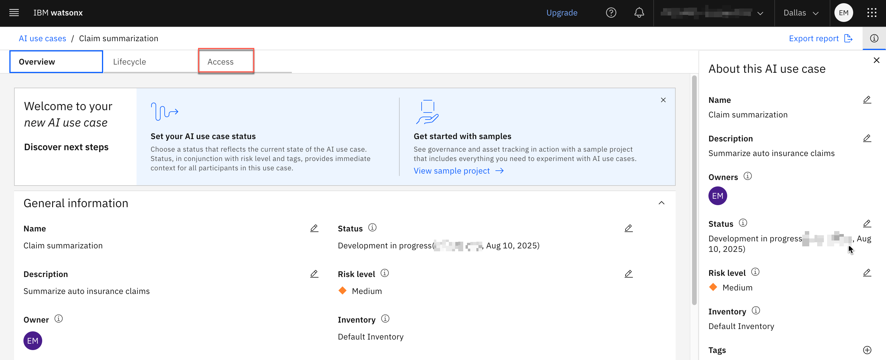

You have successfully created a use case for an AI model to address a business need. In the next step, you will associate a model with that use case for evaluation.

---

### 2. Create a new deployment space

Deployment spaces contain deployable assets, deployments, deployment jobs, associated input and output data, and runtime environments. You can use spaces to deploy various assets and manage your deployments, and control access to the models and data stored there.

1. Click the **Navigation menu** (A) in the upper left corner to open it. Click on the **Deployments** menu item (B) to expand it. Click on the **View all deployment spaces** menu item (C). The **Deployments** screen opens.

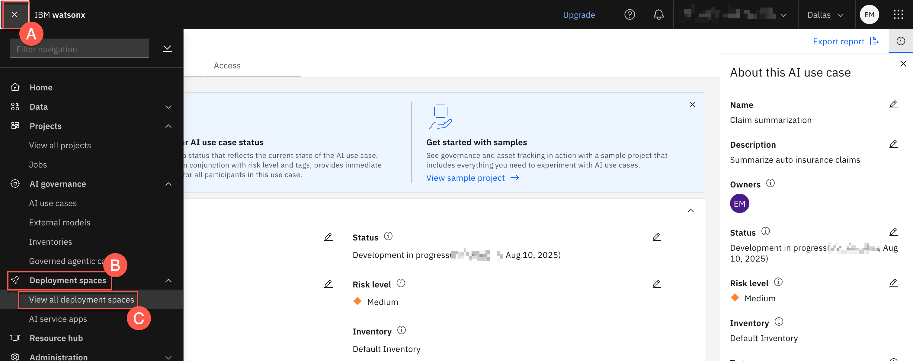

2. Click on the **New deployment space** button.

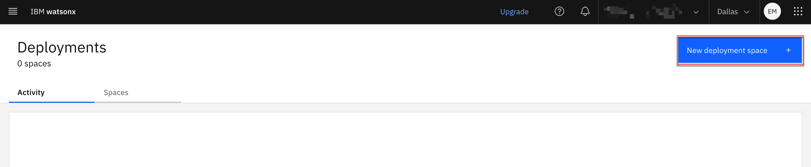

3. Give your deployment space a name (A) with identifying information such as **your** email address, and include "testing" to denote this as a space for testing. Provide a description (B) for your space.

Click on the **Deployment stage** dropdown (C), and click on **Testing** from the list. Designating the deployment stage will ensure that the models deployed in this space will appear in the correct phase of the lifecycle map in the AI use case and will use the testing view in the metrics and evaluation screens in later steps.

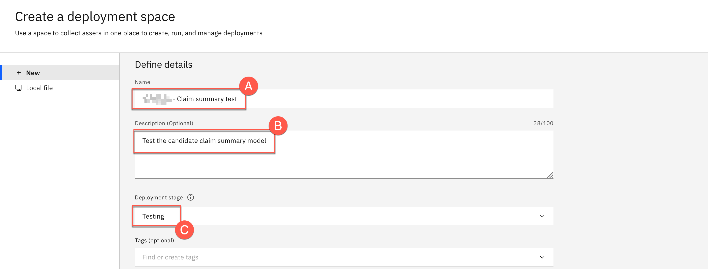

4. Ensure that the **Select storage service** dropdown (A) is correctly set to the object storage service you are using for this lab.  Click the **Select watsonx.AI Runtime** dropdown (B), then click on the watsonx.ai Runtime service you are using for this lab.

Click on the **Create** button (C). Space creation can take up to a few minutes. When it is finished, a popup window will appear informing you that the space is ready.

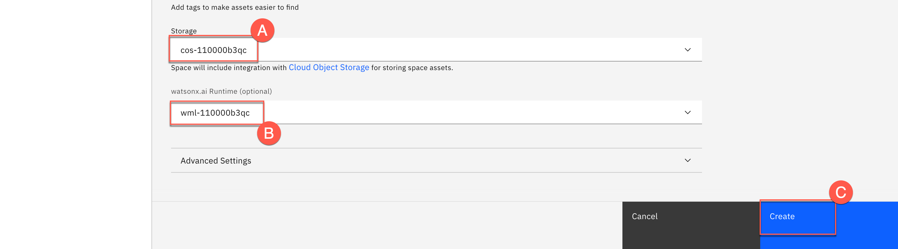

5. Once the space is created, click the **close** button to close the popup.

You have successfully created a deployment space for the deployment and testing of your model. Next, you will import assets and start to work with the model.

---

### 3. Set up a watsonx.ai project

In this step, you will create an IBM watsonx.ai project that will contain all the assets used to deploy and work with a generative model you will be governing. Watsonx projects provide a central location for data scientists, data engineers, subject-matter experts, and other stakeholders to collaborate on data science projects.

#### Create the project

1. Right-click link for the project file (see this git folder) and choose the appropriate menu option for your browser to download it to your machine. Do NOT unzip the file.
2. In a separate browser window, navigate to the watsonx projects screen. You can reach the projects screen by click on the Navigation menu (A) in the upper left, clicking on the Projects item (B) to expand it, then clicking on the View all projects menu item (C).

3. Click the blue New project button on the right.
4. Click the Local file option on the left.

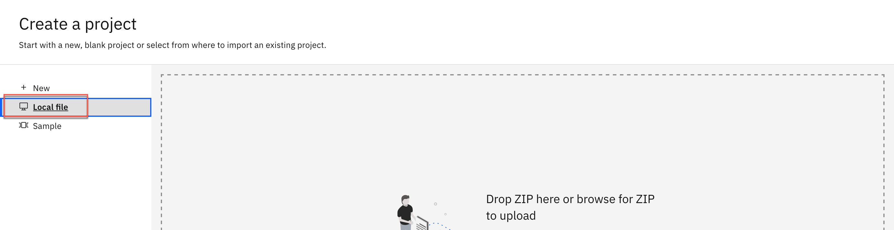

5. Click the Browse button in the middle of the screen, and browse to the zipped Auto-claim-summary.zip file you downloaded in step one.
6. Give your project a name (A), ensuring that the name begins with some identifying information such as the beginning of your email address or IBM ID. For example, emartens - Auto claim summary.
7. Give your project an optional description (B). Click on the Select storage service dropdown (C) and select the Cloud Object Storage instance associated with this environment. Click on the Create button (D) to create the project from a file.

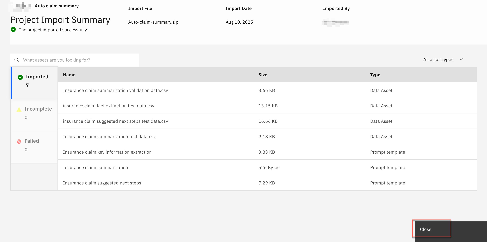

#### Verify and configure the project

When importing a project from a file, it's critical to ensure that all the resources import successfully, since the project tool will report that creation was successful even if one or more resources failed to import.

1. Click the **View import summary** button, and ensure that nothing is listed in the **Incomplete** or **Failed** categories on the left of the screen. Note that as capabilities change and this lab evolves, your screen may show more assets being imported. The important thing is that all included assets are imported, and that there are no Incomplete or Failed entries.

If an asset failed to import, you will need to return to the projects screen. Locate the project from the list, check the box to the left of it, and then click the **Delete** button from the blue menu bar that appears above the table. Then repeat the section above to re-create the project. The vast majority of project import failures can be solved by deleting and re-importing the project.

2. Once the project has successfully imported, click the **Close** button.

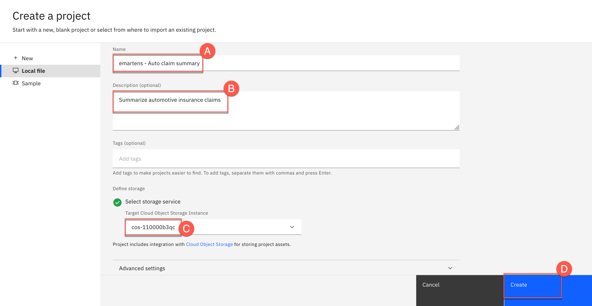

3. Click on the **Manage** tab (A). Click the **Services & integrations** item (B) from the menu on the left. Click the blue **Associate service** button (C) on the right. The **Associate service** popup window opens.

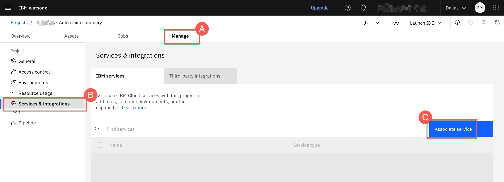

4. Locate the appropriate machine learning service for the account in the table. The **Type** column should say *watsonx.ai Runtime*, *Watson Machine Learning* or similar. If you have multiple options, choose the one that most resembles the one in the screenshot below. Check the box to the left of the service (A).

Click the blue **Associate** button (B).

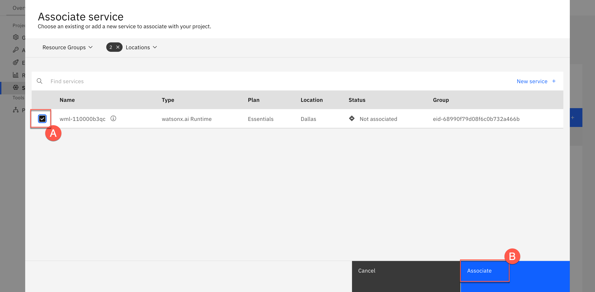

The project is now configured and ready to use.

---

### 4. Associate use case workspaces

To enable tracking the model using the use case you created in a previous step, the project and the deployment space must be associated with the different phases of the use case. Projects and deployment spaces can both contain models, assets, metadata, and access controls necessary for AI governance. For this reason, they can be described as **workspaces** for the purposes of the AI use case. Associating workspaces with different phases of the model lifecycle in the use case allows you to organize and manage governance materials in a logical manner.

1. Click on the **Navigation menu** (A) in the upper left corner to expand it. If necessary, click on the **AI governance** menu item (B) to expand it. Click on the **AI use cases** menu item (C).

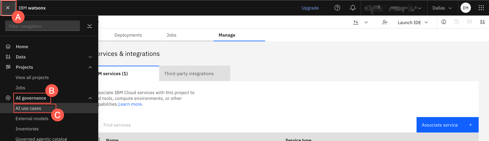

2. Locate the auto claim summarization use case you created in a previous step and click on it.
3. Scroll down to the Associated workspaces section of the screen, and note the three phases of the model lifecycle (Develop, Validate, and Operate). Workspaces (projects and deployment spaces) can be associated with each of the three phases.
4. Click on the Associate workspace button in the Develop tile. The Associate workspaces window opens.

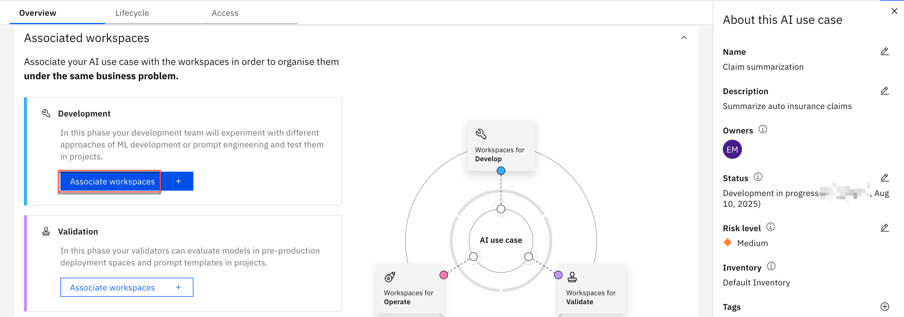

If you wish, you can use the **Read more** links on this screen to find out about the rules and reasoning behind associating workspaces with phases of the model lifecycle. Note that multiple workspaces can be associated with a single phase of the lifecycle, but a workspace can only be associated with one lifecycle phase. For example, the data science team may be working on several different candidate models for a use case, each with their own assets, collaborators, and datasets. All of these projects would be associated with the *Develop* phase of the single use case. However, each development project would only be associated with the *Develop* phase, and could not be associated with the *Validate* or *Operate* phases.

5. From the **Projects** section, check the box to the left of the claim summarization project you created in a previous step (A). Click on the **Save** button (B) to save the association. The **Associate workspaces** window will close, and the project will now appear in the **Develop** tile of the **Associated workspaces** section of the use case view.

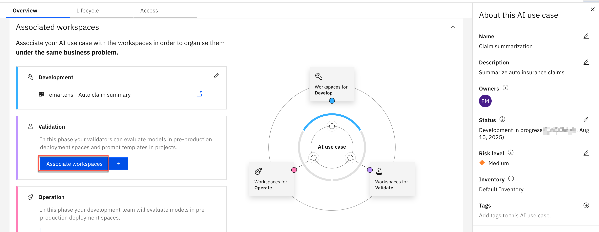

6. Click on the **Associate workspace** button in the **Validate** tile. The **Associate workspaces** window opens again.

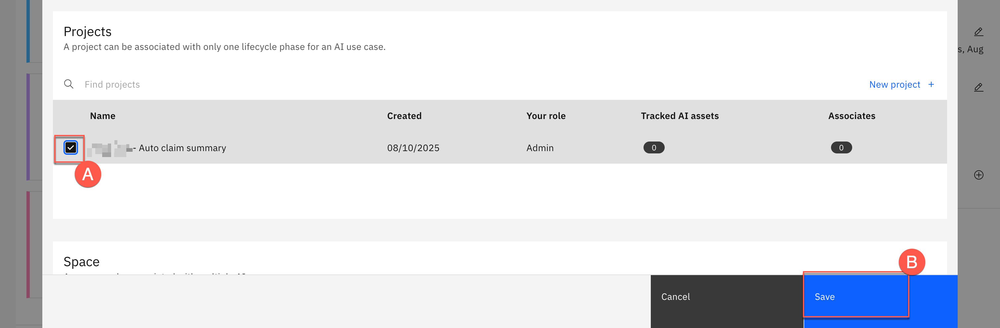

7. From the **Space** section, check the box to the left of the claim summary deployment space you created in a previous step (A). Click on the **Save** button (B) to save the association. The **Associate workspaces** window will close, and the project will now appear in the **Develop** tile of the **Associated workspaces** section of the use case view.

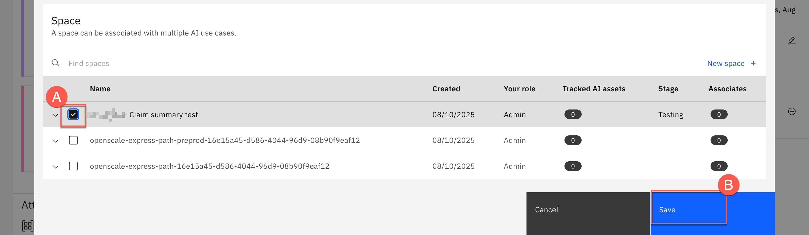

You have successfully created a use case for an AI model to address a business need, and associated your project with it. In the next step, you will begin tracking a model for evaluation.

---

### 5. Track the foundation model

This lab will use a generative model trained to summarize insurance claims. If you wish, you can click on the **Insurance claim summarization** from the list of project assets to work with it in the watsonx.ai prompt lab, though this lab will focus strictly on governing the model and not on refining it with the prompt lab.

#### Configure model tracking

1. Return to the list of watsonx projects in your browser. You can reach the projects screen by click on the **Navigation menu** (A) in the upper left, clicking on the **Projects** item (B) to expand it, then clicking on the **View all projects** menu item (C).

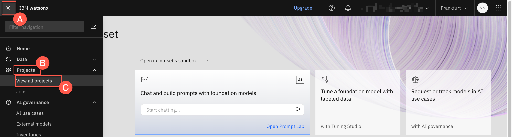

2. Locate the Auto claim summary project from the list and click on it to open it.
3. Click on the Assets tab of the project.
4. From the list of assets, locate the Insurance claim summarization entry and click on the three dots to the right to expand the context menu.
5. Click on Go to AI factsheet from the menu.

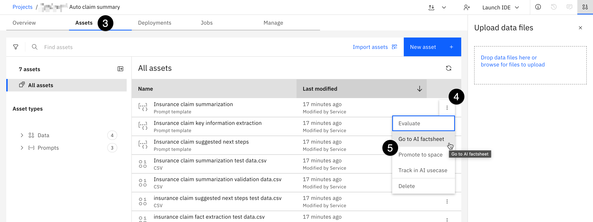

6. Take a moment to review the information gathered on this screen, including data on the foundation model it is built on, the prompt templating and basic task, and parameters. As regulations around the use of AI models increase, the ability to automatically track and easily retrieve model metadata without any manual effort from data scientists has become critical. Watsonx provides this capability, improving transparency and helping speed time-to-value for AI models.
7. Scroll back up to the Governance section and click on the Track in AI use case button.

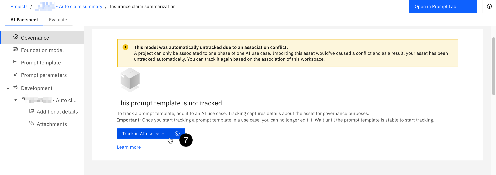

8. When asked to define an approach, leave Default approach selected and click Next.
9. When asked to assign a model version, leave Experimental selected. Note that you can manually assign a version number here, or choose a more production-ready version number depending on the state of the model. Click Next to proceed to the Review screen.
10. Click Track asset to start tracking the model. The factsheet will reload.

#### View the updated AI use case

1. Note that the Governance section of the model screen now contains information on the approach used, model version, and lifecycle phase (Develop).
2. In your browser, navigate to the list of AI use cases by clicking on the hamburger menu in the upper left, then clicking on AI use cases from the AI governance submenu.

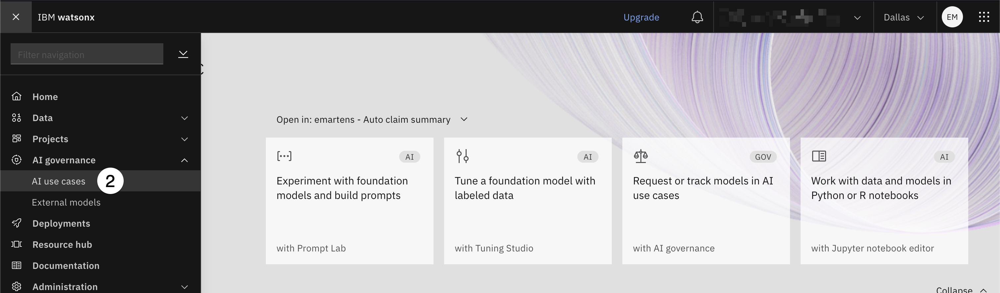

3. From the table, click on the use case you created for this section of the lab.

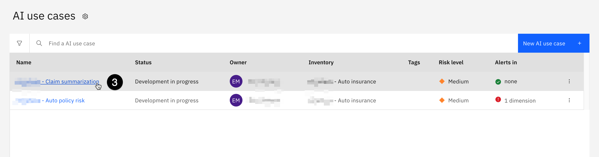

4. Click on the **Lifecycle** tab, then scroll down to the lifecycle visualization. Note that the **Insurance claim summarization** model is listed in the *Develop* section of the lifecycle.

---

### 6. Deploy the foundation model

Next, you will promote the model to a deployment space and deploy it. Watsonx uses deployment spaces to organize models and model-related assets for validation and production access.

#### Promote the model to the space

1. Return to the watsonx projects screen. You can reach the projects screen by click on the **hamburger menu** in the upper left, clicking on the **Projects** item to expand it, then clicking on the **View all projects** menu item.

2. Click on the name of the project you are using for this section of the lab to open it.
3. Click on the Assets tab.
4. Locate the Insurance claim summarization prompt template from the list of assets. Note that it has an icon to the right of the name, denoting that it is being tracked by watsonx.governance and can no longer be edited. Click the three buttons to the right of the asset name to open the context menu.
5. Click on Promote to space. The Promote to space window opens.

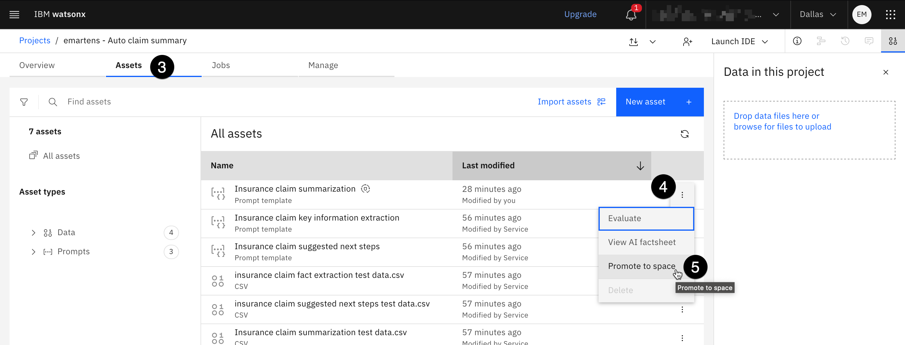

6. Click on the Target space dropdown, and click on the claim summary space you created in the previous step.
7. Check the box to the left of Go to the space after promoting the prompt template.
8. Click the Promote button.

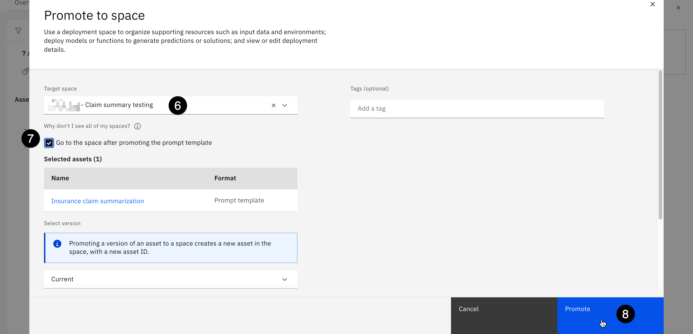

#### Create a deployment

The model has been promoted to the space, but cannot be accessed by application developers until it has been deployed.

1. Click the **New deployment** button. The **Create a deployment** window opens.

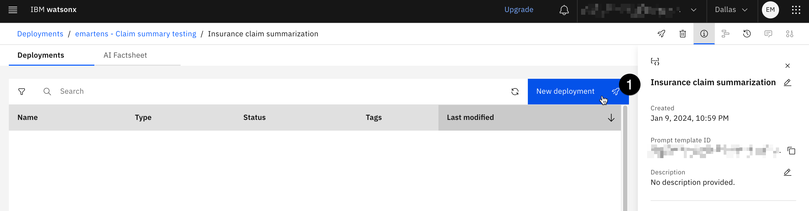

2. Give your deployed model a name with personally identifiable information.
3. Click the Create button.

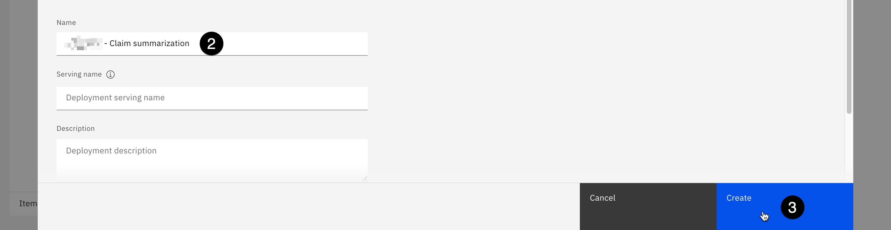

#### View the deployment details

1. Click on the new deployment from the list of deployments.

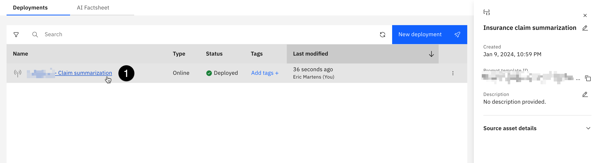

2. Note that the API reference tab contains useful information for application developers looking to integrate the model into their apps, including code snippets and endpoint links.
3. Click on the AI Factsheet tab.
4. Note that the tab shows information on the deployment, including scoring URLs. At this time, if you wish, you can return to your list of AI use cases and view this model's use case, which will reflect the same information.

---

### 7. Evaluate the foundation model

1. Right-click link for the evaluation data file (see this git folder) and choose the appropriate menu option for your browser to download it to your machine. NOTE: depending on your browser, you may need to rename the file to change the extension from .txt to .csv after downloading it, as the evaluation service will only accept comma-separated value (CSV) files as input.
2. Click on the Evaluations tab of the deployment information screen.
3. Click the Evaluate button to open the Evaluate prompt template window.

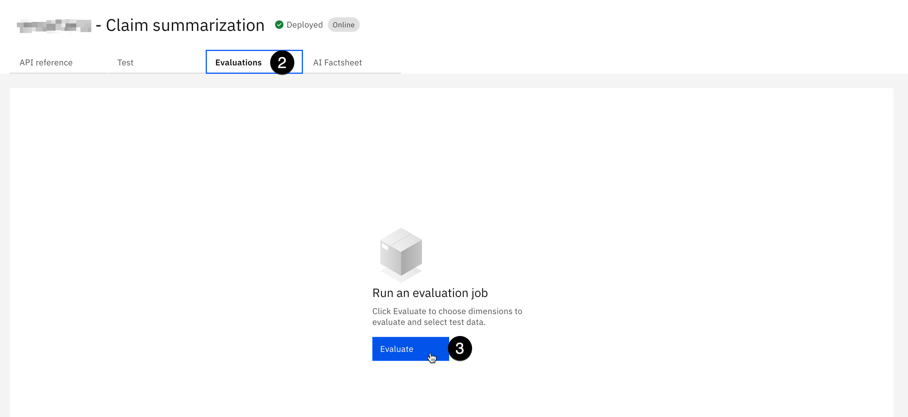

4. The **Select dimensions to evaluate** section of the window shows the different evaluations available. At the time of writing, **Generative AI Quality** and **Model health** are available for this particular prompt template. Click on the **Advanced settings** link.

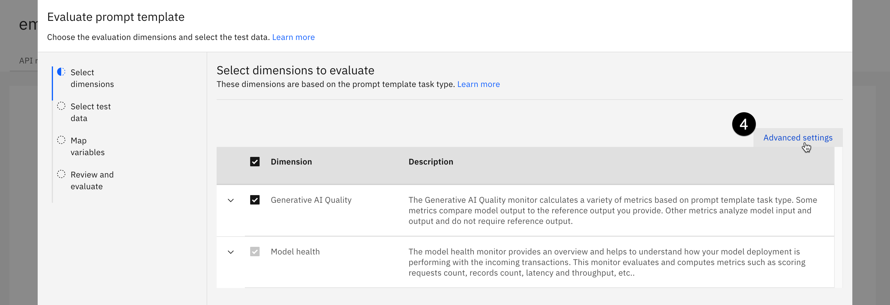

5. Take a moment to scroll through the **Generative AI Quality** settings screen to see the different metrics that will be measured as part of the quality evaluation, and the alert thresholds set for each. Note that these thresholds can be fully-customized on a per-model basis, allowing risk managers to make sure their models comply with regulatory standards. For more information on the individual metrics, see the watsonx.governance documentation.

The metrics include quality measurements such as precision, recall, and similarity, as well as personally identifiable information (PII) and hateful, aggressive, and profane (HAP) content detection for both model input and output.

6. Click Cancel to return to the Evaluate prompt template window.
7. Click Next.
8. Drag and drop the claim\_summarization\_validation.csv file you downloaded earlier (see this git folder) to the upload section on the screen, or browse to it.
9. Click on the Input dropdown, and click on Insurance\_Claim from the list.
10. Click on the Reference output dropdown, and click on Summary from the list.
11. Click Next.

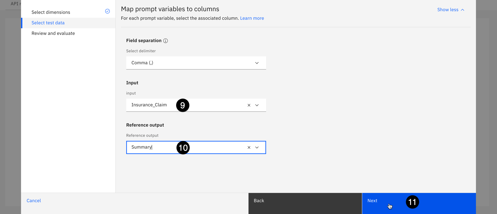

12. Click **Evaluate** to start the evaluation, which can take up to a few minutes to run. Note that if the evaluation fails, re-running it will usually complete successfully.

#### Review the evaluation results

The evaluation summary screen shows the results of the most recent evaluation.

1. Scroll down to the Generative AI Quality - Text summarization section. The different quality metrics are listed here, with the model's score and any alert threshold violations.
2. Click the arrow icon for more information on the quality metrics.

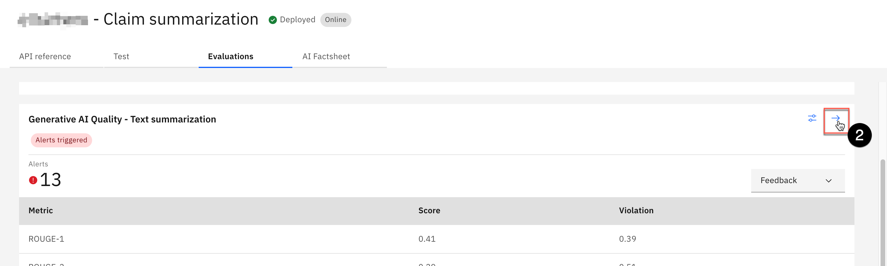

3. The detailed view for quality shows the different metrics over time; as more evaluations are performed, these graphs will update with the additional data points. Note that clicking on the Time settings link allows you to adjust the time window for the evaluations you would like to see.
4. Scroll down to the sections for the different metrics. Note that you can click to expand the sections for a more detailed view of each metric.

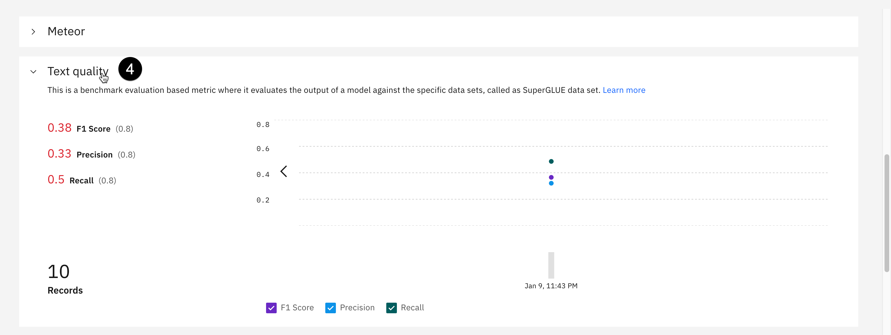

5. When you are finished viewing the quality metrics, scroll back to the top of the screen and click on the **Model health** tab.

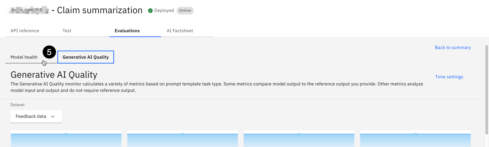

6. Take a moment to review this tab, which contains historical data for health metrics such as latency, throughput, number of users, and more. This information can be vital for an organization's infrastructure and engineering teams ensuring that the models are responding to application and user requests in a reasonable amount of time, and keeping compute costs to acceptable levels.

---

### 8. View the updated lifecycle

1. Click on the **AI Factsheet** tab, which will open the factsheet specific to the model deployment.

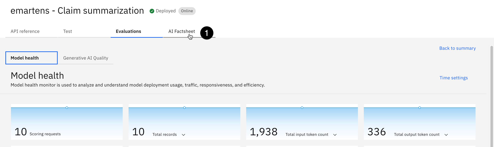

2. Note that the results of the evaluation have been automatically saved to the factsheet.
3. Scroll down to the Evaluation results section of the factsheet. The information from the model evaluation has been automatically stored in the factsheet, allowing stakeholders such as risk managers, business users, and AI engineers to access relevant information without requiring any manual effort from data scientists.
4. Scroll to the bottom of the screen and click on the More details icon.

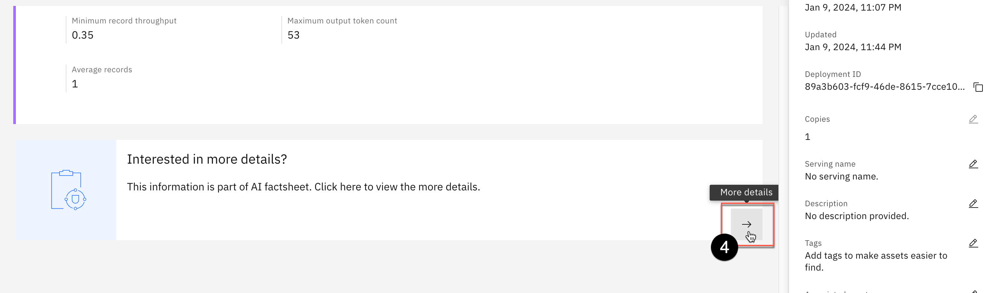

5. The full factsheet for the base model opens, containing all the previous model metadata, as well as the metrics from the deployed version.

---

### 9. Production stage

#### **Step 1: Create a Deployment Space for Production**
1. Navigate to **Deployment Spaces** in watsonx.
2. Click **Create Deployment Space**.
3. **Important:**  
   - Set all parameters to reflect **Production settings**.
   - Ensure the space is clearly labeled as **Production**.
4. Save and confirm the deployment space creation.

#### **Step 2: Associate the Space with the AI Use Case**
1. Go to **AI Use Cases** in watsonx.governance.
2. Select the AI use case you worked on during development and validation.
3. In the **Lifecycle Management** section:
   - Associate the newly created **Production Deployment Space** with the **Production lifecycle stage**.
4. Verify that the association is correctly reflected.

#### **Step 3: Promote the Prompt Template to the Production Deployment Space**
1. In watsonx.ai, locate the validated prompt template from the earlier phases.
2. Use the **Promote** option to move the template into the **Production Deployment Space**.
3. Confirm that the template now appears in the production space.

#### **Step 4: Deploy the Prompt Template in the Production Space**
1. Within the production deployment space, select the promoted prompt template.
2. Click **Deploy**.
3. Verify that the deployment status is **Active**.

#### **Step 5: Track the Prompt Template in the AI Use Case**
1. Return to the AI use case in watsonx.governance.
2. Under **Assets**, ensure the deployed prompt template is linked and tracked.
3. Confirm that governance metadata (version, deployment details) is visible.

#### **Step 6: Configure Monitors and Evaluate the Prompt Template**
1. In the production deployment space, go to **Monitoring & Evaluation**.
2. Configure monitors.
3. Run an evaluation of the prompt template using the two datasets above as payload and feedback data.
4. Review results.

---

### Conclusion

Over the course of this lab, you followed the model lifecycle, from initial use case conception through development, to validation, and production. You saw how the watsonx.governance platform provides a single solution for managing both traditional predictive models and newer generative AI models, tracking model metadata and performance across every phase of the lifecycle. You explored the ways in which watsonx.governance automated tasks like metrics gathering and report generation, and seamlessly provided that information in a fully managed environment so stakeholders can make decisions on the most up-to-date data.
