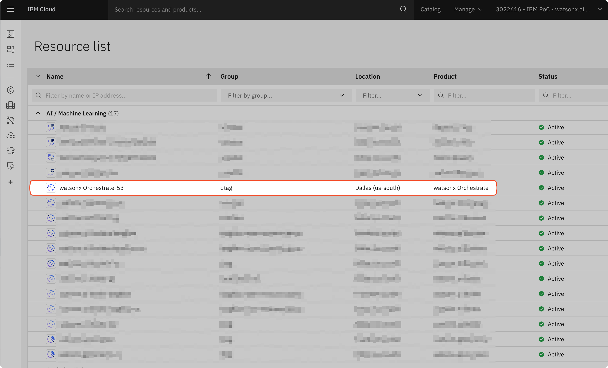
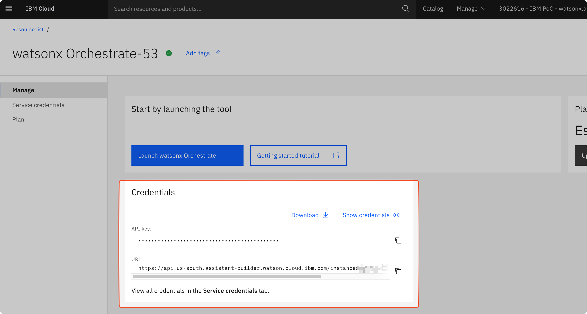
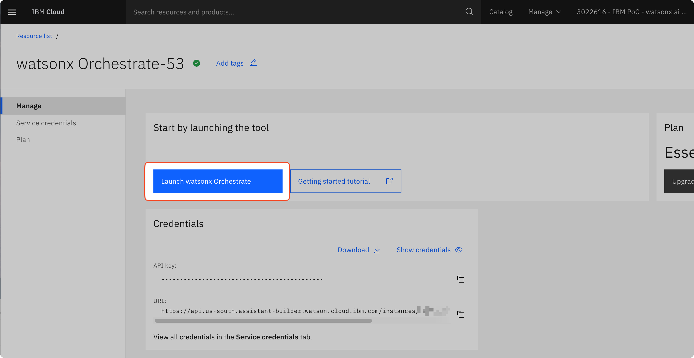

# Orchestrate with Agents


## watsonx Orchestrate Background

IBM watsonx Orchestrate is an AI-powered automation platform that enables organizations to build, deploy, and manage intelligent agents and workflows. It provides:

- **Agent Development Kit (ADK)**: Tools for creating custom AI agents that can reason, plan, and execute complex tasks
- **Tool Integration**: Connect agents to various tools, APIs, and services to extend their capabilities
- **Workflow Orchestration**: Design and automate multi-step business processes with AI-driven decision making
- **Enterprise Deployment**: Deploy agents locally for development or to IBM Cloud for production use
- **Conversational Interface**: Built-in chat interface for interacting with agents in natural language

## Prerequisites

To use this application, you will need the following:
- IBM Cloud account
- uv installed

## Obtain watsonx Orchestrate Credentials

We will grab the API Key and URL we need for Orchestrate.

1. Open your browser and open IBM Cloud and login.
2. Under the resource list, select the Orchestrate instance with tag "dtag"


3. Copy the API key and URL because we will need them in the next step


## Import Agents to watsonx Orchestrate in IBM Cloud

Enter the project directory with a new terminal window:

```bash
cd 7_orchestrate
```

### Step 1: Configure Environment Variables

```bash
cp .env.example .env
```

Ensure your `.env` file contains the following variables, which were obtained in the "Access the watsonx Orchestrate UI" section above.

```bash
WO_INSTANCE=https://api.us-south.watson-orchestrate.cloud.ibm.com/instances/YOUR_INSTANCE_ID
WO_API_KEY=your_api_key_here
```

### Step 2: Create a local python environment

Run a uv sync to import all dependencies for this project:

```bash
uv sync
```

and activate your local python environment:

```bash
source .venv/bin/activate
```

### Step 3: Add Remote Environment

Add and activate your watsonx Orchestrate remote environment:
Give it a name like orchestrate_your_name

```bash
orchestrate env add -n orchestrate_your_name -u https://api.us-south.watson-orchestrate.cloud.ibm.com/instances/YOUR_INSTANCE_ID
```

When prompted, enter your API key from the `.env` file:

```
Please enter WXO API key: [paste your WO_API_KEY]
```

### Step 4: Verify Active Environment

List all environments to confirm the remote environment is active:

```bash
orchestrate env list
```

Expected output:

```
my-watsonx-orchestrate-remote  https://api.us-south.watson-orchestrate.cloud.ibm.com/instances/908b28c9-XXX (active)
```

### Step 5: Re-activate Environment (if needed)

If you need to switch back to this environment later, or if your session expires:

```bash
orchestrate env activate orchestrate_your_name
```

Enter your API key when prompted.

> **Note:** Authentication against a remote environment expires every 2 hours. After expiration, you need to run `orchestrate env activate orchestrate_your_name` again.

### Step 6: Import Tools & Agents

**Option A: Quick Import (Recommended)**
Use the provided script to import all tools and the agent at once:

```bash
./import_tools.sh
```
> **Note:** 
> - If using this script, you can skip **Option B** as it imports everything.
> - The script will import to whichever environment is currently active (local or remote).

**Option B: Import Tools & Agents Manually**

Before importing the agent, you must import all the tools it depends on. 

Import each tool individually:

```bash
orchestrate tools import -f ./tools/support_billing.py --kind flow
orchestrate tools import -f ./tools/support_general.py --kind flow
orchestrate tools import -f ./tools/support_internet_plans.py --kind flow
orchestrate tools import -f ./tools/support_mobile_plans.py --kind flow
orchestrate tools import -f ./tools/support_network.py --kind flow
orchestrate tools import -f ./tools/support_technical.py --kind flow
```

Then import your local agent to the remote instance:

```bash
orchestrate agents import --file ./agents/orchestrating_agent/customer_service_orchestrator.yaml
```

Expected output:

```
[INFO] - Agent 'customer_service_orchestrator' imported successfully
```

### Step 7: Verify Agent Import

List all agents to confirm successful import:

```bash
orchestrate agents list
```

You should now see your `customer_service_orchestrator` agent in the list.

---

## Launch watsonx Orchestrate UI (Post-Deployment)

1. Switch to your browser and open IBM Cloud and login.
2. Under the resource list, select the Orchestrate instance with tag "dtag"

3. Click on "Launch watsonx Orchestrate"


---

## (Optionally) Local Deployment with the wxO ADK

### Prerequisites

#### The Agent Developer Kit (ADK)
**Python 3.11-3.13**
  Ensure you have Python 3.11-3.13 installed.

#### watsonx Orchestrate Developer Edition
**Machine Specs**
- 16GB RAM
- 8 cores
- 25GB disk space

> **Note:** If you run with Document Processing enabled, you will need **at least an additional 3GB of memory** (i.e., a total of **19GB RAM**) to ensure stable operation.

**A Docker Engine**
  Ensure that you have a docker engine installed capable of running docker compose.
  The watsonx Orchestrate team recommends either [Rancher](https://rancherdesktop.io/) or [Colima](https://github.com/abiosoft/colima).

  Please make sure your instance of Rancher or Colima is configured with the following settings:
  * [Rancher](./_docs/recommended-docker-settings/rancher-settings.md)
  * [Colima](./_docs/recommended-docker-settings/coilma-settings.md)

### Setup Environment Variables

**If you already configured `.env` for remote deployment:**
Add the following watsonx.ai credentials to your existing `.env` file:
Edit `.env` and add your watsonx.ai credentials:
```bash
WATSONX_API_KEY=your_watsonx_api_key
WATSONX_SPACE_ID=your_space_id
WATSONX_URL=https://us-south.ml.cloud.ibm.com
```

> **Note:** We do not have WO credentials here because watsonx Orchestrate will be lcoally deployed.

**If starting fresh with local deployment only:**
Copy the example environment file and configure it:

```bash
cp .env.example .env
```

Then edit .env and add your watsonx.ai credentials:
```bash
WATSONX_API_KEY=your_watsonx_api_key
WATSONX_SPACE_ID=your_space_id
WATSONX_URL=https://us-south.ml.cloud.ibm.com
```

### Setup Docker Engine

#### With Docker Desktop

Download Docker Desktop for Mac or Windows and follow the instructions to install it:
https://www.docker.com/products/docker-desktop/

#### With Colima (Recommended)

Install and start Colima with 4 CPU cores, 18GB of RAM and 20GB of disk space:

```bash
brew install colima
colima start --cpu 4 --memory 18 --disk 20
```

See Github project: https://github.com/abiosoft/colima

### Build and Run Your Local Agent

#### Step 1: Start the Server

Initialize the watsonx Orchestrate server locally using Docker containers:

```bash
orchestrate server start --env-file .env
```

This will start the local watsonx Orchestrate Developer Edition.

#### Step 2: Activate the Local Environment

Activate the local ADK environment:

```bash
orchestrate env activate local
```

Expected output:
```
[INFO] - local tenant found
[INFO] - Environment 'local' is now active
```

#### Step 3: Import Tools and Agent

Import all tools and the agent to your local environment:

```bash
./import_tools.sh
```

Or import manually:
```bash
# Import tools
orchestrate tools import -f ./tools/support_billing.py --kind flow
orchestrate tools import -f ./tools/support_general.py --kind flow
orchestrate tools import -f ./tools/support_internet_plans.py --kind flow
orchestrate tools import -f ./tools/support_mobile_plans.py --kind flow
orchestrate tools import -f ./tools/support_network.py --kind flow
orchestrate tools import -f ./tools/support_technical.py --kind flow

# Import agent
orchestrate agents import -f ./agents/orchestrating_agent/customer_service_orchestrator.yaml
```

#### Step 4: Verify Agent Import

List all agents to confirm successful import:

```bash
orchestrate agents list
```

Expected output:
```
 Agents
┏━━━━━━━━━━━━━━━━━━━━━━━━━━━━━━━━━┳━━━━━━━━━━━━━━━━━━━━━━━━━━━┳━━━━━━━━━━━━━━━━━━━━━━━━━━━┳━━━━━━━━━┳━━━━━━━━━━━━━━━┳━━━━━━━━━━━━━━━━━━━━━━━━━━━┓
┃ Name                            ┃ Description               ┃ LLM                       ┃ Style   ┃ Tools         ┃ ID                        ┃
┡━━━━━━━━━━━━━━━━━━━━━━━━━━━━━━━━━╇━━━━━━━━━━━━━━━━━━━━━━━━━━━╇━━━━━━━━━━━━━━━━━━━━━━━━━━━╇━━━━━━━━━╇━━━━━━━━━━━━━━━╇━━━━━━━━━━━━━━━━━━━━━━━━━━━┩
│ customer_service_orchestrator   │ Customer service agent    │ watsonx/meta-llama/...    │ react   │ 6 tools       │ 42db7f18-XXXXXXXX         │
└─────────────────────────────────┴───────────────────────────┴───────────────────────────┴─────────┴───────────────┴───────────────────────────┘
```

#### Step 5: Start the Chat Interface

Launch the lightweight chat interface:

```bash
orchestrate chat start
```

The chat interface will be available at **http://localhost:3000/**

You can now interact with your customer service agent through the web interface!

## Full Documentation

see https://github.com/IBM/ibm-watsonx-orchestrate-adk

