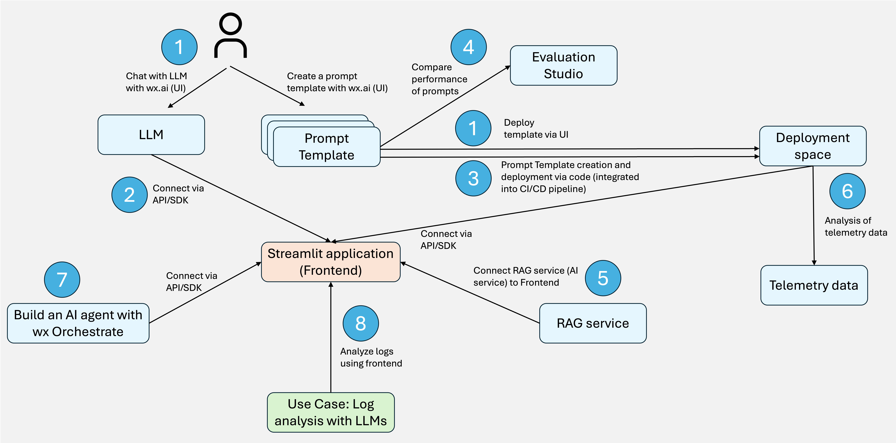

# IBM watsonx.ai Hands-on Workshop

Welcome to the IBM watsonx.ai hands-on workshop! This repository contains a comprehensive guide to working with IBM watsonx.ai, covering everything from basic setup to advanced features like orchestration, evaluation, and CI/CD integration.

## 🎯 Overview

This hands-on workshop is designed to help you learn and implement various IBM watsonx.ai capabilities through practical exercises. Each directory contains a specific module with its own README and exercises.

The following chart shows a high-level overview on the different parts of the workshop:

- Lab 1 demonstrates how to deploy a prompt template using the watsonx.ai UI.
- Lab 2 shows how to programmatically connect to a deployed prompt template and integrate it with a sample Streamlit (frontend) application.
- Lab 3 explains how to deploy a prompt template via code and integrate the process into your CI/CD pipeline.
- Lab 4 demonstrates how to use the Evaluation Studio to compare the performance of different prompts or LLMs.
- Lab 5 shows how to connect to a RAG service deployed in watsonx.ai (AI service).
- Lab 6 covers how to analyze telemetry data related to LLM usage in watsonx.ai.
- Lab 7 shows how to build your own AI agents using watsonx Orchestrate.
- Lab 8 presents an example use case for log analysis leveraging LLMs in watsonx.ai.

## 📋 Prerequisites

Before starting, ensure you have:
- IBM Cloud account with watsonx.ai access (see [setup IBM account](./0_prerequisites/setup_IBM_account.md))
- API key and project ID from watsonx.ai (you will receive these in our session)
- UV and packages installed and tested (see [0_prerequisites](./0_prerequisites/README.md))

## 🗂️ Workshop Modules

### [0️⃣ Prerequisites](./0_prerequisites/README.md)
**Setup and verification of your development environment**

- Install UV package manager (macOS, Windows, Linux)
- Automatic Python 3.12 installation
- Verify all required dependencies
- Test your setup with a verification script

**Key Topics:**
- UV package manager installation
- Python environment setup
- Dependency verification

---

### [1️⃣ watsonx.ai UI Exploration](./1_wx-UI/README.md)
**Get familiar with the watsonx.ai user interface**

- Create and manage watsonx.ai projects
- Explore the Prompt Lab for interactive LLM chat
- Understand the watsonx.ai dashboard and features
- Navigate through different watsonx.ai services

**Key Topics:**
- Project creation and management
- Prompt Lab basics
- UI navigation and features

---

### [2️⃣ Chat with Your Models](./2_chat-with-your-models/README.md)
**Build a Streamlit frontend to interact with watsonx.ai models**

- Set up a Streamlit application
- Configure environment variables (.env) for watsonx.ai connection
- Connect to watsonx.ai models via API
- Deploy and chat with prompt templates
- Build an interactive chat interface

**Key Topics:**
- Streamlit frontend development
- watsonx.ai API integration
- Environment configuration
- Model interaction via API
- Prompt template deployment and usage

---

### [3️⃣ CI/CD Integration](./3_CI-CD/README.md)
**Automate deployment and management of watsonx.ai resources**

- Deploy prompt templates programmatically
- Manage prompt templates via code
- Update configurations through .env files
- Implement evaluation pipelines with notebooks
- Set up continuous integration workflows

**Key Topics:**
- Infrastructure as Code
- Automated prompt template deployment
- Configuration management
- Code-based evaluation
- CI/CD pipeline setup

---

### [4️⃣ Evaluation Studio](./4_evaluation-studio/README.md)
**Evaluate and optimize your models and prompts**

- Use Evaluation Studio UI for model comparison
- Test different prompts for optimal results
- Implement governance best practices
- Evaluate model performance metrics
- Compare multiple models side-by-side

**Key Topics:**
- Model evaluation techniques
- Prompt optimization
- Governance and compliance
- Performance metrics
- A/B testing for prompts

---

### [5️⃣ External Data Sources](./5_external-data/README.md)
**Connect and utilize external data in your applications**

- Integrate external APIs with Streamlit frontend
- Build RAG (Retrieval-Augmented Generation) endpoints
- Chat with your documents
- Use AutoAI RAG for automated model/prompt evaluation
- Create additional tabs in Streamlit based on Jupyter notebooks

**Key Topics:**
- External API integration
- RAG implementation
- Document-based chat
- AutoAI RAG evaluation
- Jupyter notebook integration

---

### [6️⃣ AI Governance Telemetry](./6_ai-governance-telemetry/README.md)
**Monitor and analyze watsonx.ai usage and performance**

- Access watsonx telemetry data
- Monitor API usage and performance
- Track model interactions
- Analyze usage patterns
- Set up monitoring dashboards

**Key Topics:**
- Telemetry data collection
- Performance monitoring
- Usage analytics
- Dashboard creation

---

### [7️⃣ Orchestrate with Agents](./7_orchestrate/README.md)
**Implement AI orchestration with agents and tools**

- Create simple agents with web search capabilities
- Integrate Model Context Protocol (MCP) tools
- Use watsonx Orchestrate via API
- Build agent-based workflows
- Optional: Explore Orchestrate ADK (Agent Development Kit)

**Key Topics:**
- AI agent creation
- Web search tool integration (MCP)
- Orchestrate API usage
- Agent workflow design
- Advanced orchestration with ADK

---

### [8️⃣ Evaluate Logs (Technical Sales Lab)](./8_evaluate-logs/README.md)
**Practical use case: Analyze log files with watsonx.ai**

- Create a real-world use case for log analysis
- Generate sample log files
- Test watsonx.ai solutions for log evaluation
- Implement log parsing and analysis
- Extract insights from log data

**Key Topics:**
- Log file analysis
- Use case development
- Solution testing
- Pattern recognition in logs
- Automated log evaluation

---

## License

Sample Materials, provided under license.
Licensed Materials - Property of IBM.
© Copyright IBM Corp. 2024,2025. All Rights Reserved.
US Government Users Restricted Rights - Use, duplication or disclosure restricted by GSA ADP Schedule Contract with IBM Corp.